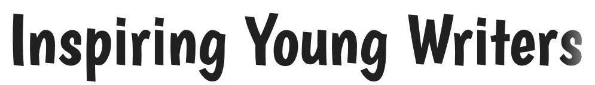

# Inspiring Young Writers

Developer: Georgina Carlisle

Image showing deployed project to go here.

Inspiring Young Writers is a platform specifically designed for children aged 8 - 12 to share their writing and give and gain feedback.

Project currently under development and no live link available.

## Contents

[Design](#design)

- [The Strategy Plane](#the-strategy-plane)

- [The Scope Plane](#the-scope-plane)

- [The Structure Plane](#the-structure-plane)

- [The Skeleton Plane](#the-skeleton-plane)

- [The Surface Plane](#the-surface-plane)

[Agile Methodology](#agile-methodology)

[Features](#features)

- [Existing Features](#existing-features)

- [Future Features](#future-features)

[Languages](#languages)

[Frameworks and Libraries](#frameworks-and-libraries)

[Tools and Technologies](#tools-and-technologies)

[Testing and Validation](#testing-and-validation)

[Bugs and Fixes](#bugs-and-fixes)

[Deployment](#deployment)

[Credits](#credits)

[Acknowledgements](#acknowledgements)

---

## Design

### The Strategy Plane

#### Target User Group

Children who can write and specifically children aged 8 – 12.

They can:

- Use a keyboard to type.
- Spell words, put together sentences and build a larger piece of writing.
- Articulate simple concepts or ideas through the written word.

However, they are still developing the skills needed to:

-	Articulate clearly more complex thoughts, ideas and concepts through the written word.
-	Write for the reader and include details that will allow the reader to fully understand the story/concept etc.
-	Build narratives that flow, with the story they are telling working together as a whole.

#### Problem Background

Becoming an articulate writer and being able to tell a story (whether fiction or non-fiction) for an audience is a complex skill that takes time and practice to master. As with any skill, it is practice, exposure and feedback that leads to progress. 

Primary schools do an amazing job of helping children to progress with their writing. However, while children get plenty of chance to practice writing at school, their writing is usually accompanied by restriction (a theme, writing style, time limit, particular language construct to be focused on) and even the environment of a classroom can provide further restriction. 

Where then can children build in this practice of writing for an audience in a less restricted way? Where can they share their writing and gain feedback, motivation, inspiration, and exposure to stories written by those at a similar skill level to them?

There are plenty of writing competitions for children and magazines where they can send stories. However, these again often come with restrictions (theme, word count, deadline) and often don’t lend themselves to a child being able to continually share new stores and quickly gain feedback.

#### Problem Statement

“I am a child who has the potential to become a fantastic writer, however a lack of opportunity to share and gain feedback from writing created purely for pleasure means I have less motivation and reason to write. I therefore write less and gain less feedback which ultimately means my progression is less than it could be.”

#### Project Aim

This project aims to provide children aged 8 - 12 with a safe space where they can share their writing - created for pleasure without restriction - and gain feedback.

#### Safety Considerations

As this project is aimed at children, extra thought needs to be given to making sure the space provided for them to share their writing in is safe. 

Two main areas of danger will be considered throughout this project:

-	The danger of children being exposed to material or comments that are inappropriate or may cause harm.
-	The danger of someone being able to contact and connect with a child (whether in the space or outside via the gaining of contact information) which then leaves them vulnerable to abuse.

[Return to contents list](#contents)

---

### The Scope Plane

The scope of this project is provided by user stories, organised below by epic and then role.

#### EPIC - New User Experience

View User Stories

As a **new user** the website is clearly geared towards children age 8 - 12 and sharing writing, so that I know what the website is about and that it is suitable for me. (1)

As a **new user** I can read work written by another child so that I am inspired to write and share my writing. (2)

As a **new user** I am given clear information on what registered users can do, so that I know what signing up will allow me to see and do. (3)

As the **parent of a new user** I am provided with information which details how the site works, the steps in place to protect my child and what me and my child can do to increase safety, so that I am fully aware of how the site works. (4)

As the **parent of a new user** I can contact the site admin, so that I can raise any concerns or ask any questions about the site. (5)

As the **site admin** user's question and concerns along with their contact details are passed to me, so that I can then respond. (6)

As a **new user** I am provided with the name and contact links for the developer who created this platform, so that I know who created the platform and how to get in touch with them. (7)

As a **new user** I am informed when page link errors occur and provided with a link straight back to the landing page, so that my experience is disrupted as little as possible and I understand what has happened. (8)

#### EPIC - Authentication

View User Stories

As a **new user** I can easily set up an account, so that I can access registered user only content and share my stories. (9)

As the **parent of a new user** I am asked to input my name and email address and give consent for my child joining the site so I can take a full role in my child’s participation on the platform. (10)

As a **registered user** I can use my pen-name and password to login to my account, so that my account remains secure and only I can login. (11)

As a **signed-in user** I can easily logout of my account, so that I can keep my account secure. (12)

As a **registered user** (with the help of my parent) I can reset my password using a link sent to my parent’s email, so that if I forget my password I can still login to my account. (13)

#### EPIC - Profile Management

View User Stories

As a **signed-in user** I can edit my profile so that I can update my details. (14)

As a **signed-in user** I can delete my account, so that I can remove all my contributions and details from the platform should I wish. (15)

As the **parent of a registered user** I am informed of any profile changes my child makes and my consent to any changes is required, so that I can continue to support my child. (16)

As the **site admin** I can remove accounts, so that I can prevent unsuitable users from accessing and using the platform. (17)

As the **parent of a registered user** I am informed via email if my child’s account has been removed including the reason why, so that I can support my child to understand what has happened. (18)

#### EPIC - Account Home

View User Stories

As a **signed-in user** user once logged in I am taken to a home page for my account, so that I have access to all the registered user features and it is clear I am logged in to my account. (19)

As a **signed-in user** I am provided with tips on how I can use the platform when I first log in to my account, so that I understand how to use the platform. (20)

As a **signed-in user** I am informed when page link errors occur and provided with a link straight back to my account home page, so that my experience is disrupted as little as possible and I understand what has happened. (21)

As the **parent of a signed-in user** I can also access the information for parents when my child is logged in, so that I can always access that information should I need it. (22)

As the **parent of a signed-in user** I can also contact the site admin when my child is logged in, so that there is always an easy to access way to contact the site admin. (23)

#### EPIC - My Work

View User Stories

As a **signed-in user** I can navigate to a page where all my work is listed by status, so that I can quickly view all my work and see its current status. (24)

As a **signed-in user** I am provided with tips and ideas for the sort of work I could create, so that I know I am not restricted and can submit a wide range of genres and text types. (25)

As a **signed-in user** I can write and submit a piece of work with title, so that I can share my writing with others. (26)

As a **signed-in user** my writing is passed through validation tests before it is saved, so that any text that may cause harm is prevented from entering the platform. (27)

As a **signed-in user** I can write a blurb for my writing, so that I can entice other readers to read my work. (28)

As a **signed-in user** I can attach a picture to my writing, so that I can entice other readers to read my work by giving them a quick glimpse of what it might be about. (29)

As a **signed-in user** I can save a draft of my work so that I can continue to work on it another time. (30)

As a **signed-in user** I can view my published work, so that I can re-read my writing. (31)

As a **signed-in user** I can view and edit any work pending approval, so that I can re-read and edit should I wish. (32)

As a **signed-in user** I can view and edit my draft work, so that I can continue building on my writing. (33)

As a **signed-in user** I can delete my writing, so that I can remove any of my writing that is saved on the platform should I wish. (34)

#### EPIC - Approval of writing

View User Stories

As the **site admin** all stories need to be validated by me before they are posted to the page, so that I can ensure no inappropriate material is posted to the site. (35)

As the **site admin** I am informed when a child submits their writing for approval, so that I can respond to the request in a timely fashion. (36)

As the **site admin** I can send a message to the user should their writing fail to meet approval guidelines, so that I can keep users informed. (37)

As the **site admin** I can send parents an email sharing the submitted story and the reason why it failed to meet approval, so that I can keep parents informed and provide them with the information needed to support their child to keep other users on the site safe. (38)

As the **site admin** I can remove approved status from previously approved work, so that I can respond to any concerns raised post approval. (39)

#### EPIC - Library of Published work

View User Stories

As a **signed-in user** I can view work from other users, so that I can gain inspiration and tips for my own writing. (40)

As a **signed-in user** I can filter work, so that I can more easily find stories that I am interested in. (41)

As a **signed-in user** I can click a help button should I see/read something I don’t like, so that I can keep myself safe. (42)

As the **parent of a signed-in user** my child is prompted to seek out my guidance should they see/read something they don’t like, so that I can support them and then proceed as appropriate. (43)

As the **parent of a signed-in user** I can raise concern about a specific piece of writing, so that I can help keep my child and others safe. (44)

As the **site admin** I am alerted immediately to any raised concerns, so that I can respond swiftly. (45)

#### EPIC - Feedback

View User Stories

As a **signed-in user** I can give feedback to other users, so that I can support my peers. (46)

As a **signed-in user** I can view all feedback associated with a piece of work, so that I can gain tips to improve my own writing. (47)

As a **signed-in user** my feedback is passed through validation tests, so that I don’t cause harm to another user. (48)

As a **signed-in user** I can edit my feedback, so that I can resolve a mistake should I make one. (49)

As a **signed-in user** I can delete my feedback, so that I can remove my comments should I wish to. (50)

As a **signed-in user** I am alerted to any new feedback on my published work, so that I don’t miss any feedback. (51)

As a **signed-in user** I can view feedback given to me by other users, so that I can grow in confidence and improve as a writer. (52)

As a **signed-in user** I can edit my published work, so that I can make changes in response to feedback should I wish. (53)

As a **signed-in user** I can delete feedback given to me by other users, so that I can control the feedback that is associated with my work. (54)

As a **signed-in user** I can click a help button should I see something in the feedback that worries me, so that I can keep myself safe. (55)

As the **parent of a signed-in user** my child is prompted to seek out my guidance should they see/read something in the feedback that worries them, so that I can support them and then proceed as appropriate. (56)

As the **parent of a signed-in user** I can raise concern about a specific piece of feedback, so that I can help keep my child and others safe. (57)

As the **site admin** I am alerted immediately to any raised concerns about feedback, so that I can respond swiftly. (58)

As the **site admin** I can remove inappropriate feedback, so that I can keep users safe. (59)

As the **site admin** I can send parents an email sharing posted feedback and the reason it has been removed, so that I can keep parents informed and provide them with the information needed to support their child to keep other users on the site safe. (60)

#### Additional User Stories added after initial planning phase

View User Stories

As a **user** I can navigate intuitively through the site, so that I can quickly access the areas I need. (64)
- Initially this was going to be handled as part of other user stories. However, I then later decided it would sit better as a user story in it's own right.

[Return to contents list](#contents)

---

### The Structure Plane

The following diagrams show how the platform will be structured and how the user will move through it.

The following diagram shows the models that will be used to store all the data needed by the platform and any connections between the different models.

[Return to contents list](#contents)

---

### The Skeleton Plane

The following wire frames show the intended design for the platform on both mobile and desktop.

The platform will be split into two distinction sections:
- New User Experience (the part of the platform that can be accessed without logging in)
- Authenticated User Experience (this will be unique to each registered user and can only be accessed by logging in)

#### New User Experience

This section of the platform can be accessed by anyone and will consist of four pages and one modal. Each page will build on the same base template and will share the same header, hero image, footer and background.

Landing Page

The main url will direct straight to the landing page.

Notes: The landing page can be re-accessed by clicking on the platform name in the top left corner. The sign-up today section will also contain details about the ability to give and recieve feedback, should this feature be implemented.

Contact

This page provides parents of new users with a means of contacting the site admin.

Notes: Feedback will be provided to the user if any of the form input fields fail to pass validation. Feedback to the user will also be provided on successful submission of the form.

Sign-up

This page provides new users alongside their parents with the means to register for the platform and create an account.

Notes: Feedback will be provided to the user if any of the form input fields fail to pass validation. Feedback to the user will also be provided on successful submission of the form.

Login

This page provides registered users with the means to login to their account.

Notes: Feedback will be provided to the user if any of the form input fields fail to link to a known account. Feedback to the user will also be provided on successful user authentication prior to redirection to their account home page.

Parent Information Modal

This part of the platform provides parents with all the information they should need. It has been created as a modal, so that it can be viewed during the sign-up process (as well as independently as shown here) without the user needing to come away from the sign-up form. 

Notes: In the above view the modal is shown as accessed from the landing page.

#### Authenticated User Experience

This section of the platform can only be accessed by a registered user logging into their account and will allow them to access to their work as well as published work. It will consist of six pages. Each page will build on the same base template and will share the same header, footer and background. Two of these pages will also contain a number of changing modals.

Account Home

This is the page a user will be directed to when they first log in.

Notes: The Tips will be about how to use the platform. Providing support and guidance for users.

Contact

This page ensures the parents of users can still contact the site admin and that it's a feature that spans both sections of the platform.

Notes: The contact form when sent will pull information from the users profile, such as email address, pen-name of the child and name of parent. Feedback will be provided to the user if any of the form input fields fail to pass validation. Feedback to the user will also be provided on successful submission of the form.

Profile

This page allows the user to edit their profile information as well as delete thier account should they wish.

Notes: Any changes to the users profile will need to be verified by their parent via an email sent to the registered email address. Feedback will be provided to the user if any of the form input fields fail to pass validation. Feedback to the user will also be provided on successful submission of the form.

Information for parents

This page allows the parent of a user to still access all the information provided during the new user experience section of the website.

My Work

This is the page that the user will use to access, edit, create and delete all of their work.
Notes: The Tips will include ideas for the sort of work the user could create. Each listed item of work can be clicked on to bring that piece up in a modal.

Clicking on the create new work button (from the my work page or as a shortcut from account home), or on a draft item of work, or clicking to edit a published or submitted piece of work with bring up the **edit** view. This will either be empty or prepopulated with the work to be editted.

Clicking on a published piece of work will bring it up in this view.
This wireframe shows the view once the feedback feature has also been implemented.

Clicking on a submitted piece of work will bring it up in this view.

Library

This is the page that the user will use to access published work from other users.
Notes: The Tips will include ideas around gaining inspiration and tips from other peoples writing.

Users will be able to click on a published piece of work to expand it.
Notes: This view is prior to the comments feature being implemented

Every published piece of work will have a red flag next to the title, clicking on the red flag brings up this view.

The following view shows how viewing a published piece of work will look once the comment feature has been implemented. Including how the user can create feedback.

The following wireframes show how a user can edit or delete their feedback. The edit and delete functionality will only be active on feedback they have written.

Every item of feedback will have a red flag next to the authors name, clicking on the red flag brings up this view.

[Return to contents list](#contents)

---

### The Surface Plane

#### Typography

Three different fonts have been chosen for the platform to provide extra distinctness to text used for different purposes. All the fonts are sans serif to make for clear text that is easy to read and share some common themes so that they work well together. All fonts have been sourced from [Google Fonts](https://fonts.google.com).

##### Headings
The font **Boogaloo** by [John Vargas Beltran](https://fonts.google.com/specimen/Boogaloo?preview.text=Inspiring%20Young%20Writers&classification=Display&stroke=Sans+Serif) has been chosen for all the headings across the site. It has a more organic feel with clear character while still being clear and easy to read.

##### Main platform text
The font **Ubuntu** by [Dalton Maag](https://fonts.google.com/specimen/Ubuntu?preview.text=View%20Feedback&stroke=Sans+Serif) has been chosen for all the main text on the platform. It is the most uniform of the three texts, while still showing a little organic character.

##### Children's work text
A third font has been chosen so that any text generated by the users, such as their work and feedback, stands out against the main platform text. The font **Ubuntu Mono** by [Dalton Maag](https://fonts.google.com/specimen/Ubuntu+Mono) has been chosen for this purpose. It is more akin to handwritten text, while still maintaining a clearness and uniformity which will be important during it's use for large blocks of text.

[Return to contents list](#contents)

## Agile Methodology

Agile values and principles have been followed in the creation of this project where they fit into a solo project built purely for educational purposes.

In particular the following common Agile practices have been followed:
user stories, story points and team velocity, product backlog, time boxing, prioritization and information radiators.

### User Stories

Please see the [Scope Plane](#the-scope-plane) for the user stories created for this project which breakdown the Epics detailing the main features of the platform into manageable chunks of work.

The issues tool on GitHub has been used to record all user stories. Acceptance criteria and tasks were added to the user stories as the project progressed.

### Story Points and Team Velocity

Story Points were used as a way to judge how long a user story might take to complete. With an estimated team velocity used to judge how many story points may beable to be completed per iteration and therefore which user stories to add to the next iteration.

In order to judge story points the following user story was used as the base guide and given a value of **2 story points**:
> 3 - As a new user I am given clear information on what registered users can do, so that I know what signing up will allow me to see and do.

I chose this user story to base the story points on, as I felt it represent a fairly short and familiar task.

A Doubling score was then used when estimating story points for other user stories, with familiarity of the coding needed to complete the user story also taken into account. Story points were also re-assessed at the beginning of each new iteration in light of work already completed and my increasing confidence and familiarity with Django.

Story points were recorded using labels attached to the user story.

An initial team velocity was set as **40 story points a week**. Note that the 4 iterations will each be a week long.

### Product Backlog

A product backlog was used in which to store all user stories, prior to being assigned into an iteration. Any user stories not completed at the end of the iteration were then moved back into the backlog. At the end of the project a number of user stories remained in the product backlog. These have been discussed in the [future features](#future-features) section of the readme.

The product backlog is visible on GitHub through the use of a milestone titled "Backlog" and a specific backlog column in the project board.

### Time Boxing

Developement of the project was split into four time boxes/iterations. Each iteration was set to a period of one week.

#### First Iteration

#### Second Iteration

#### Third Iteration

#### Fourth Iteration

### MoSCoW Prioritisation

MoSCoW prioritisation was used throughout the project. At the beginning of each new iteration the project backlog was accessed and each user story categorised for the current iteration (not the project over all), thus allowing for the correct balance of prioritisation for each iteration. This process was repeated for each new iteration, being mindful at all times of the overall remaining project time left.

- **Must Have** the user stories deemed vital for this iteration of the project.

- **Should Have** the user stories deemed important but not vital for this iteration of the project.

- **Could Have** the user stories that will only have a small impact if left out of this iteration of the project.

- **Won't Have** the user stories that won't be worked on during this iteration of the project. These weren't speicifically labelled and were simply left in the backlog.

#### Extra notes on prioritisation

It is to be noted that:

- While solving a real world problem and being designed for the real world this project is being built for education purposes only.

- The nature of the project involving children has necessitated a large number of user stories geared around safety. All of which in the real world would need to be in place and therefore designated **Must Have**.

- Completing ALL of the user stories geared around safety is not a viable or necessary aim of this project, given that the real underlying purpose of this project is to showcase software development skills and it is current form won't be released as a real project for anyone to sign-up to and use.

Therefore it has been decided for this particular project that user stories geared around safety won't necessarily be prioritised as must haves. However, should any remain uncompleted at the end of the project a full explanation will be given.

### Information Radiators

GitHub projects was utilised as a kanban board for this project.

[Return to contents list](#contents)

## Features

### Existing Features

[Return to contents list](#contents)

### Future Features

[Return to contents list](#contents)

## Languages

HTML
CSS
JavaScript
Python

[Return to contents list](#contents)

## Frameworks and Libraries

[Django 3.2](https://www.djangoproject.com) - A high-level Python web framework that encourages rapid development and clean, pragmatic design.

[Gunicorn 21.2](https://gunicorn.org) - A Python WSGI HTTP Server for UNIX.

[Psycopg2 2.9](https://www.psycopg.org/docs/#) -  A PostgreSQL database adapter for the Python programming language.

## Tools and Technologies

Tools and technologies are listed in order of use during the development of this project.

[Code Institute Template](https://github.com/Code-Institute-Org/ci-full-template) - Provided me with a familiar base from which to build my project.

[GitHub](https://github.com/) - Stores the repository for this project so that it can be viewed by others.

[git](https://git-scm.com/) - Controlled the building of this project in a series of versions which can be tracked.

[Visual Studio Code](https://code.visualstudio.com/) - The editor in which this project has been built. The following extentions were installed and used: Markdown Preview Enhanced

[Drawio](https://www.drawio.com) - Used to visually plan out the structure of the platform and how the user will be able to move through it.

[LucidChart](https://www.lucidchart.com/pages/) - Used to plan the models to be included in the database and how they connect together.

[Balsamiq](https://balsamiq.com) - Used to create wireframes showing the skeleton plane of the design phase.

[Cloudinary](https://cloudinary.com) - Image and video API platform.

[Heroku](https://www.heroku.com) - Used to host and deploy the project.

[ElephantSQL](https://www.elephantsql.com) - Used to store the PostgreSQL database.

[Tailwind CSS](https://tailwindcss.com/) - A utility-first CSS framework.

[Canva](https://www.canva.com) - Used to create the hero image.

[Return to contents list](#contents)

## Testing and Validation

See [TESTING.md](TESTING.md) for all testing and validation

## Bugs and Fixes

| Bug | What was tried | Fix |
| -- | ----- | --- |
| Tailwind CSS working locally, but not being served on the deployed site. | Research into Tailwind and Django. Research into Tailwind and Heroku. Tested different methods of installing Tailwind. Tried various fixes to deploy through Heroku. Went back to basics. Found advice from slack community around Heroku and static files. Worked back through changes, which changes were needed and which weren't. | Followed [Tailwind CSS Django - Flowbite](https://flowbite.com/docs/getting-started/django/) to install Tailwind with css files stored in best location. Set DISABLE_COLLECTSTATIC to 0 on Heroku. Specific Deployment Branch with Debug to False. Run the command **./manage.py collectstatic** prior to deployment. |

[Return to contents list](#contents)

## Deployment

[Return to contents list](#contents)

## Credits

### Code

[Code Institute](https://codeinstitute.net) - "I think therefore I Blog" walkthrough followed when installing dependencies and deploying to Heroku. 

[BroBonds](https://github.com/GeorginaCarlisle/brobonds-movember-hackathon) 
- Influenced how I chose to structure the apps, folders and files in this project.
- Used as a reference point when creating views

### Images

[boys-using-silver-macbook](https://www.pexels.com/photo/boy-using-silver-macbook-indoors-3401403/) by Agung Pandit Wiguna - Used to create Hero Image.

[girl-watching-movie-on-laptop](https://www.pexels.com/photo/little-girl-watching-movie-on-laptop-4017428/) by Gustavo Fring - Used to create Hero Image.

[girl-typing-on laptop](https://www.pexels.com/photo/focused-asian-girl-typing-on-laptop-at-home-5905969/) by Katerina Holmes - Used to create Hero Image.

[young-woman-sitting-on-the-carpet-while-using-laptop](https://www.pexels.com/photo/a-young-woman-sitting-on-the-carpet-while-using-her-laptop-5998826/) by cottonbro studio - Used to create Hero Image.

### Font

[Boogaloo](https://fonts.google.com/specimen/Boogaloo) - John Vargas Beltram

[Ubuntu](https://fonts.google.com/specimen/Ubuntu) - by Dalton Maag

[Ubuntu-Mono](https://fonts.google.com/specimen/Ubuntu+Mono) - by Dalton Maag

[Return to contents list](#contents)

## Acknowledgements

[Code Institute](https://codeinstitute.net) - The majority of the coding skills, knowledge and understanding showcased in this project have been learnt through the 'Diploma of Full stack software development' that I am completing with Code Institute.

Code Institute's Slack community - Provided me with support and key insight into issues I was facing. Where specific support was gained, this has been noted either in [credits](#credits) or in [bugs](#bugs-and-fixes) as appropriate.

### Other projects

I spent time looking at Django projects created by other students and how they utilised Django, the information contained in their readme and the testing they completed. This aided my understanding of the Django framework as well as providing a reference for good documentation and testing. Any code directly copied or which has heavily influenced my code has been mentioned in [Credits](#credits).

[BroBonds](https://github.com/GeorginaCarlisle/brobonds-movember-hackathon) - A Django blog and event style project created by Team!Alone of which I was a team member.

[Tailor's Thimble](https://github.com/MoniPar/tailors_thimble) - A fictional business website created by MoniPar.

[Tribe](https://github.com/adamgilroy22/tribe) - A social media application created by Adam Gilroy.

[Knowledge Flow](https://github.com/rockroman/CI_PP4-Knowledge-Flow) - A learning and blogging application created by RockRoman.

[Dome Restaurant](https://github.com/christiangoran/dome-restaurant-repo) - A restaurant booking website created by Christian Goran.

[AutoMarket](https://github.com/Dayana-N/AutoMarket-PP4) - A listing site for selling cars created by Dayana-N.

### Websites, articles and tutorials

The following websites, articles and tutorials are listed in order of use during the development of this project.

[Conventional Commits](https://www.conventionalcommits.org/en/v1.0.0/) - I followed the structure given in this article for my commit messages.

[Using Git - how to go back to a previous commit](https://medium.com/swlh/using-git-how-to-go-back-to-a-previous-commit-8579ccc8180f) - I followed this article when reverting to a previous commit.

[Tailwind CSS Django - Flowbite](https://flowbite.com/docs/getting-started/django/) - Instructions in article followed to install tailwind css.

[Tailwind CSS Tutorial #6 - Custom Fonts by Net Ninja](https://www.youtube.com/watch?v=arfDRUIZOiw) - Instructions in video followed to create custom font family styles.

[Return to contents list](#contents)
