# Inspiring Young Writers

Developer: Georgina Carlisle

Image showing deployed project to go here.

Inspiring Young Writers is a platform specifically designed for children aged 8 - 12 to share their writing and give and gain feedback.

Project currently under development and no live link available.

## Contents

[Design](#design)

- [The Strategy Plane](#the-strategy-plane)

- [The Scope Plane](#the-scope-plane)

- [The Structure Plane](#the-structure-plane)

- [The Skeleton Plane](#the-skeleton-plane)

- [The Surface Plane](#the-surface-plane)

[Agile Methodology](#agile-methodology)

[Features](#features)

- [Existing Features](#existing-features)

- [Future Features](#future-features)

[Languages](#languages)

[Frameworks and Libraries](#frameworks-and-libraries)

[Tools and Technologies](#tools-and-technologies)

[Testing and Validation](#testing-and-validation)

[Bugs and Fixes](#bugs-and-fixes)

[Deployment](#deployment)

[Credits](#credits)

[Acknowledgements](#acknowledgements)

---

## Design

### The Strategy Plane

#### Target User Group

Children who can write and specifically children aged 8 – 12.

They can:

- Use a keyboard to type.
- Spell words, put together sentences and build a larger piece of writing.
- Articulate simple concepts or ideas through the written word.

However, they are still developing the skills needed to:

- Articulate clearly more complex thoughts, ideas and concepts through the written word.
- Write for the reader and include details that will allow the reader to fully understand the story/concept etc.
- Build narratives that flow, with the story they are telling working together as a whole.

#### Problem Background

Becoming an articulate writer and being able to tell a story (whether fiction or non-fiction) for an audience is a complex skill that takes time and practice to master. As with any skill, it is practice, exposure and feedback that leads to progress.

Primary schools do an amazing job of helping children to progress with their writing. However, while children get plenty of chance to practice writing at school, their writing is usually accompanied by restriction (a theme, writing style, time limit, particular language construct to be focused on) and even the environment of a classroom can provide further restriction.

Where then can children build in this practice of writing for an audience in a less restricted way? Where can they share their writing and gain feedback, motivation, inspiration, and exposure to stories written by those at a similar skill level to them?

There are plenty of writing competitions for children and magazines where they can send stories. However, these again often come with restrictions (theme, word count, deadline) and often don’t lend themselves to a child being able to continually share new stores and quickly gain feedback.

#### Problem Statement

“I am a child who has the potential to become a fantastic writer, however a lack of opportunity to share and gain feedback from writing created purely for pleasure means I have less motivation and reason to write. I therefore write less and gain less feedback which ultimately means my progression is less than it could be.”

#### Project Aim

This project aims to provide children aged 8 - 12 with a safe space where they can share their writing - created for pleasure without restriction - and gain feedback.

#### Safety Considerations

As this project is aimed at children, extra thought needs to be given to making sure the space provided for them to share their writing in is safe.

Two main areas of danger will be considered throughout this project:

- The danger of children being exposed to material or comments that are inappropriate or may cause harm.
- The danger of someone being able to contact and connect with a child (whether in the space or outside via the gaining of contact information) which then leaves them vulnerable to abuse.

[Return to contents list](#contents)

---

### The Scope Plane

The scope of this project is provided by user stories, organised below by epic and then role.

#### EPIC - New User Experience

View User Stories

As a **new user** the website is clearly geared towards children age 8 - 12 and sharing writing, so that I know what the website is about and that it is suitable for me. (1)

As a **new user** I can read work written by another child so that I am inspired to write and share my writing. (2)

As a **new user** I am given clear information on what registered users can do, so that I know what signing up will allow me to see and do. (3)

As the **parent of a new user** I am provided with information which details how the site works, the steps in place to protect my child and what me and my child can do to increase safety, so that I am fully aware of how the site works. (4)

As the **parent of a new user** I can contact the site admin, so that I can raise any concerns or ask any questions about the site. (5)

As the **site admin** user's question and concerns along with their contact details are passed to me, so that I can then respond. (6)

As a **new user** I am provided with the name and contact links for the developer who created this platform, so that I know who created the platform and how to get in touch with them. (7)

As a **new user** I am informed when page link errors occur and provided with a link straight back to the landing page, so that my experience is disrupted as little as possible and I understand what has happened. (8)

#### EPIC - Authentication

View User Stories

As a **new user** I can easily set up an account, so that I can access registered user only content and share my stories. (9)

As the **parent of a new user** I am asked to input my name and email address and give consent for my child joining the site so I can take a full role in my child’s participation on the platform. (10)

As a **registered user** I can use my pen-name and password to login to my account, so that my account remains secure and only I can login. (11)

As a **signed-in user** I can easily logout of my account, so that I can keep my account secure. (12)

As a **registered user** (with the help of my parent) I can reset my password using a link sent to my parent’s email, so that if I forget my password I can still login to my account. (13)

#### EPIC - Profile Management

View User Stories

As a **signed-in user** I can edit my profile so that I can update my details. (14)

As a **signed-in user** I can delete my account, so that I can remove all my contributions and details from the platform should I wish. (15)

As the **parent of a registered user** I am informed of any profile changes my child makes and my consent to any changes is required, so that I can continue to support my child. (16)

As the **site admin** I can remove accounts, so that I can prevent unsuitable users from accessing and using the platform. (17)

As the **parent of a registered user** I am informed via email if my child’s account has been removed including the reason why, so that I can support my child to understand what has happened. (18)

#### EPIC - Account Home

View User Stories

As a **signed-in user** user once logged in I am taken to a home page for my account, so that I have access to all the registered user features and it is clear I am logged in to my account. (19)

As a **signed-in user** I am provided with tips on how I can use the platform when I first log in to my account, so that I understand how to use the platform. (20)

As a **signed-in user** I am informed when page link errors occur and provided with a link straight back to my account home page, so that my experience is disrupted as little as possible and I understand what has happened. (21)

As the **parent of a signed-in user** I can also access the information for parents when my child is logged in, so that I can always access that information should I need it. (22)

As the **parent of a signed-in user** I can also contact the site admin when my child is logged in, so that there is always an easy to access way to contact the site admin. (23)

#### EPIC - My Work

View User Stories

As a **signed-in user** I can navigate to a page where all my work is listed by status, so that I can quickly view all my work and see its current status. (24)

As a **signed-in user** I am provided with tips and ideas for the sort of work I could create, so that I know I am not restricted and can submit a wide range of genres and text types. (25)

As a **signed-in user** I can write and submit a piece of work with title, so that I can share my writing with others. (26)

As a **signed-in user** my writing is passed through validation tests before it is saved, so that any text that may cause harm is prevented from entering the platform. (27)

As a **signed-in user** I can write a blurb for my writing, so that I can entice other readers to read my work. (28)

As a **signed-in user** I can attach a picture to my writing, so that I can entice other readers to read my work by giving them a quick glimpse of what it might be about. (29)

As a **signed-in user** I can save a draft of my work so that I can continue to work on it another time. (30)

As a **signed-in user** I can view my published work, so that I can re-read my writing. (31)

As a **signed-in user** I can view and edit any work pending approval, so that I can re-read and edit should I wish. (32)

As a **signed-in user** I can view and edit my draft work, so that I can continue building on my writing. (33)

As a **signed-in user** I can delete my writing, so that I can remove any of my writing that is saved on the platform should I wish. (34)

#### EPIC - Approval of writing

View User Stories

As the **site admin** all stories need to be validated by me before they are posted to the page, so that I can ensure no inappropriate material is posted to the site. (35)

As the **site admin** I am informed when a child submits their writing for approval, so that I can respond to the request in a timely fashion. (36)

As the **site admin** I can send a message to the user should their writing fail to meet approval guidelines, so that I can keep users informed. (37)

As the **site admin** I can send parents an email sharing the submitted story and the reason why it failed to meet approval, so that I can keep parents informed and provide them with the information needed to support their child to keep other users on the site safe. (38)

As the **site admin** I can remove approved status from previously approved work, so that I can respond to any concerns raised post approval. (39)

#### EPIC - Library of Published work

View User Stories

As a **signed-in user** I can view work from other users, so that I can gain inspiration and tips for my own writing. (40)

As a **signed-in user** I can filter work, so that I can more easily find stories that I am interested in. (41)

As a **signed-in user** I can click a help button should I see/read something I don’t like, so that I can keep myself safe. (42)

As the **parent of a signed-in user** my child is prompted to seek out my guidance should they see/read something they don’t like, so that I can support them and then proceed as appropriate. (43)

As the **parent of a signed-in user** I can raise concern about a specific piece of writing, so that I can help keep my child and others safe. (44)

As the **site admin** I am alerted immediately to any raised concerns, so that I can respond swiftly. (45)

#### EPIC - Feedback

View User Stories

As a **signed-in user** I can give feedback to other users, so that I can support my peers. (46)

As a **signed-in user** I can view all feedback associated with a piece of work, so that I can gain tips to improve my own writing. (47)

As a **signed-in user** my feedback is passed through validation tests, so that I don’t cause harm to another user. (48)

As a **signed-in user** I can edit my feedback, so that I can resolve a mistake should I make one. (49)

As a **signed-in user** I can delete my feedback, so that I can remove my comments should I wish to. (50)

As a **signed-in user** I am alerted to any new feedback on my published work, so that I don’t miss any feedback. (51)

As a **signed-in user** I can view feedback given to me by other users, so that I can grow in confidence and improve as a writer. (52)

As a **signed-in user** I can edit my published work, so that I can make changes in response to feedback should I wish. (53)

As a **signed-in user** I can delete feedback given to me by other users, so that I can control the feedback that is associated with my work. (54)

As a **signed-in user** I can click a help button should I see something in the feedback that worries me, so that I can keep myself safe. (55)

As the **parent of a signed-in user** my child is prompted to seek out my guidance should they see/read something in the feedback that worries them, so that I can support them and then proceed as appropriate. (56)

As the **parent of a signed-in user** I can raise concern about a specific piece of feedback, so that I can help keep my child and others safe. (57)

As the **site admin** I am alerted immediately to any raised concerns about feedback, so that I can respond swiftly. (58)

As the **site admin** I can remove inappropriate feedback, so that I can keep users safe. (59)

As the **site admin** I can send parents an email sharing posted feedback and the reason it has been removed, so that I can keep parents informed and provide them with the information needed to support their child to keep other users on the site safe. (60)

#### Additional User Stories added after initial planning phase

View User Stories

As a **user** I can navigate intuitively through the site, so that I can quickly access the areas I need. (64)

- Initially this was going to be handled as part of other user stories. However, I then later decided it would sit better as a user story in it's own right.

[Return to contents list](#contents)

---

### The Structure Plane

The following diagrams show how the platform will be structured and how the user will move through it.

The following diagram shows the models that will be used to store all the data needed by the platform and any connections between the different models.

[Return to contents list](#contents)

---

### The Skeleton Plane

The following wire frames show the intended design for the platform on both mobile and desktop.

The platform will be split into two distinction sections:

- New User Experience (the part of the platform that can be accessed without logging in)
- Authenticated User Experience (this will be unique to each registered user and can only be accessed by logging in)

#### New User Experience

This section of the platform can be accessed by anyone and will consist of four pages and one modal. Each page will build on the same base template and will share the same header, hero image, footer and background.

Landing Page

The main url will direct straight to the landing page.

Notes: The landing page can be re-accessed by clicking on the platform name in the top left corner. The sign-up today section will also contain details about the ability to give and recieve feedback, should this feature be implemented.

Contact

This page provides parents of new users with a means of contacting the site admin.

Notes: Feedback will be provided to the user if any of the form input fields fail to pass validation. Feedback to the user will also be provided on successful submission of the form.

Sign-up

This page provides new users alongside their parents with the means to register for the platform and create an account.

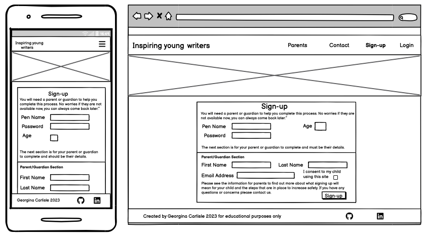

Notes: Feedback will be provided to the user if any of the form input fields fail to pass validation. Feedback to the user will also be provided on successful submission of the form.

Login

This page provides registered users with the means to login to their account.

Notes: Feedback will be provided to the user if any of the form input fields fail to link to a known account. Feedback to the user will also be provided on successful user authentication prior to redirection to their account home page.

Parent Information Modal

This part of the platform provides parents with all the information they should need. It has been created as a modal, so that it can be viewed during the sign-up process (as well as independently as shown here) without the user needing to come away from the sign-up form.

Notes: In the above view the modal is shown as accessed from the landing page.

#### Authenticated User Experience

This section of the platform can only be accessed by a registered user logging into their account and will allow them to access to their work as well as published work. It will consist of six pages. Each page will build on the same base template and will share the same header, footer and background. Two of these pages will also contain a number of changing modals.

Account Home

This is the page a user will be directed to when they first log in.

Notes: The Tips will be about how to use the platform. Providing support and guidance for users.

Contact

This page ensures the parents of users can still contact the site admin and that it's a feature that spans both sections of the platform.

Notes: The contact form when sent will pull information from the users profile, such as email address, pen-name of the child and name of parent. Feedback will be provided to the user if any of the form input fields fail to pass validation. Feedback to the user will also be provided on successful submission of the form.

Profile

This page allows the user to edit their profile information as well as delete thier account should they wish.

Notes: Any changes to the users profile will need to be verified by their parent via an email sent to the registered email address. Feedback will be provided to the user if any of the form input fields fail to pass validation. Feedback to the user will also be provided on successful submission of the form.

Information for parents

This page allows the parent of a user to still access all the information provided during the new user experience section of the website.

My Work

This is the page that the user will use to access, edit, create and delete all of their work.
Notes: The Tips will include ideas for the sort of work the user could create. Each listed item of work can be clicked on to bring that piece up in a modal.

Clicking on the create new work button (from the my work page or as a shortcut from account home), or on a draft item of work, or clicking to edit a published or submitted piece of work with bring up the **edit** view. This will either be empty or prepopulated with the work to be editted.

Clicking on a published piece of work will bring it up in this view.
This wireframe shows the view once the feedback feature has also been implemented.

Clicking on a submitted piece of work will bring it up in this view.

Library

This is the page that the user will use to access published work from other users.
Notes: The Tips will include ideas around gaining inspiration and tips from other peoples writing.

Users will be able to click on a published piece of work to expand it.
Notes: This view is prior to the comments feature being implemented

Every published piece of work will have a red flag next to the title, clicking on the red flag brings up this view.

The following view shows how viewing a published piece of work will look once the comment feature has been implemented. Including how the user can create feedback.

The following wireframes show how a user can edit or delete their feedback. The edit and delete functionality will only be active on feedback they have written.

Every item of feedback will have a red flag next to the authors name, clicking on the red flag brings up this view.

[Return to contents list](#contents)

---

### The Surface Plane

#### Typography

Three different fonts have been chosen for the platform to provide extra distinctness to text used for different purposes. All the fonts are sans serif to make for clear text that is easy to read and share some common themes so that they work well together. All fonts have been sourced from [Google Fonts](https://fonts.google.com).

##### Headings

The font **Boogaloo** by [John Vargas Beltran](https://fonts.google.com/specimen/Boogaloo?preview.text=Inspiring%20Young%20Writers&classification=Display&stroke=Sans+Serif) has been chosen for all the headings across the site. It has a more organic feel with clear character while still being clear and easy to read.

##### Main platform text

The font **Ubuntu** by [Dalton Maag](https://fonts.google.com/specimen/Ubuntu?preview.text=View%20Feedback&stroke=Sans+Serif) has been chosen for all the main text on the platform. It is the most uniform of the three texts, while still showing a little organic character.

##### Children's work text

A third font has been chosen so that any text generated by the users, such as their work and feedback, stands out against the main platform text. The font **Ubuntu Mono** by [Dalton Maag](https://fonts.google.com/specimen/Ubuntu+Mono) has been chosen for this purpose. It is more akin to handwritten text, while still maintaining a clearness and uniformity which will be important during it's use for large blocks of text.

#### Colour Scheme

Three key thoughts inspired the chosen colour scheme:

1 - Children's websites and apps tend to use bold colours. By then using bold colours for this platform it helps it to stand out as being for children.

2 - The colour scheme should be linked with creativity, imagination and positivity. The following article [Colors that inspire creativity](https://www.innovation-creativity.com/colors-that-inspire-creativity/) suggested that the core colors that inspire creativity are thought to be orange and yellow. With orange being said to inspire creativity and enthusiasm and yellow to inspire creativity, imagination, and inspiration.

3 - All text should provide a high contrast to the background and meet accessibility guidelines.

Four background colours have been chosen:

- A very light zinc gray #FAFAFA (250, 250, 250)
- A lighter yellowy orange #F6BD58 (246, 189, 88)
- An orange #EA580C (234, 88, 12)
- A dark blue #1E3A8A (30 58 138);

With three text colours:

- Black #000000 for all the main text
- Orange #EA580C (234, 88, 12) for the main titles
- A darker orange #C2410C (194, 65, 12) for titles with a smaller font weight and size.

##### Colour contrast

The following images show the contrast between the text and background across the platform.

It is to be noted that the above text colour will only be used with this background for very large text. Where the text is smaller (but still larger than avergae) the colour documented below will be used.

[Return to contents list](#contents)

## Agile Methodology

Agile values and principles have been followed in the creation of this project where they fit into a solo project built purely for educational purposes.

In particular the following common Agile practices have been followed:
user stories, story points and team velocity, product backlog, time boxing, prioritization and information radiators.

### User Stories

Please see the [Scope Plane](#the-scope-plane) for the user stories created for this project which breakdown the Epics detailing the main features of the platform into manageable chunks of work.

The issues tool on GitHub has been used to record all user stories. Acceptance criteria and tasks were added to the user stories as the project progressed.

### Story Points and Team Velocity

Story Points were used as a way to judge how long a user story might take to complete. With an estimated team velocity used to judge how many story points may beable to be completed per iteration and therefore which user stories to add to the next iteration.

In order to judge story points the following user story was used as the base guide and given a value of **2 story points**:

> 3 - As a new user I am given clear information on what registered users can do, so that I know what signing up will allow me to see and do.

I chose this user story to base the story points on, as I felt it represent a fairly short and familiar task.

A Doubling score was then used when estimating story points for other user stories, with familiarity of the coding needed to complete the user story also taken into account. Story points were also re-assessed at the beginning of each new iteration in light of work already completed and my increasing confidence and familiarity with Django.

Story points were recorded using labels attached to the user story.

An initial team velocity was set as **40 story points a week**. Note that the 4 iterations will each be a week long.

### Product Backlog

A product backlog was used in which to store all user stories, prior to being assigned into an iteration. Any user stories not completed at the end of the iteration were then moved back into the backlog. At the end of the project a number of user stories remained in the product backlog. These have been discussed in the [future features](#future-features) section of the readme.

The product backlog is visible on GitHub through the use of a milestone titled "Backlog" and a specific backlog column in the project board.

### Time Boxing

Developement of the project was split into four time boxes/iterations. Each iteration was set to a period of one week.

#### First Iteration

During the first iteration the following user stories and key tasks were completed and closed:

At the end of the iteration the following user stories remained un-completed and open:

It is to be noted that the:

- **Contact** user story (#5) had all tasks completed, however it failed manual testing with a bug and additional task identified. Both have been added into the backlog as issues.
- **Page link errors** (#8) user story cannot be fully completed until authorisation is in place.
- **Contact form data passed to Admin** (#6) user story despite not being part of this iteration has also been partially completed.

#### Second Iteration

During the second iteration the following user stories and key tasks were completed and closed:

At the end of the iteration the following user stories remained un-completed and open:

It is to be noted that the:

- **Admin access to delete accounts** user story (#17) has an associated bug (#72) requiring additional support and 
will therefore be completed in the next iteration.

#### Third Iteration

During the third iteration I was able to increase my team velocity, completing all the initial user stories set for the interation (40 story points worth) and adding more. There were no open user stories at the end of the iteration.

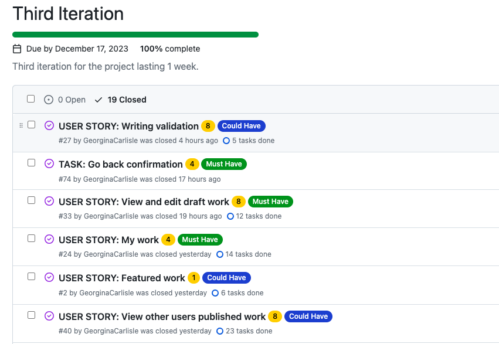

#### Fourth Iteration

Due to increasing my time velocity during the third iteration, a larger number of story points were added to this iteration. As the fourth iteration was the final iteration only a few of these were marked as must haves, with the majority being should or could. Over the course of the iteration a final stopping place was decided on based on available time left.

The following user stories and key tasks were completed and closed:

At the end of the iteration the following user stories remained un-completed and open. With a decision to leave these as future features along with the remaining backlog:

#### Final Backlog

After the completion of iteration four, the following user stories remained in the backlog to be implemented in the future. Please see [Future Features](#future-features) for more details.

### MoSCoW Prioritisation

MoSCoW prioritisation was used throughout the project. At the beginning of each new iteration the project backlog was accessed and each user story categorised for the current iteration (not the project over all), thus allowing for the correct balance of prioritisation for each iteration. This process was repeated for each new iteration, being mindful at all times of the overall remaining project time left.

- **Must Have** the user stories deemed vital for this iteration of the project.

- **Should Have** the user stories deemed important but not vital for this iteration of the project.

- **Could Have** the user stories that will only have a small impact if left out of this iteration of the project.

- **Won't Have** the user stories that won't be worked on during this iteration of the project. These weren't speicifically labelled and were simply left in the backlog.

#### Extra notes on prioritisation

It is to be noted that:

- While solving a real world problem and being designed for the real world this project is being built for education purposes only.

- The nature of the project involving children has necessitated a large number of user stories geared around safety. All of which in the real world would need to be in place and therefore designated **Must Have**.

- Completing ALL of the user stories geared around safety is not a viable or necessary aim of this project, given that the real underlying purpose of this project is to showcase software development skills and it is current form won't be released as a real project for anyone to sign-up to and use.

Therefore it has been decided for this particular project that user stories geared around safety won't necessarily be prioritised as must haves. However, should any remain uncompleted at the end of the project a full explanation will be given.

### Information Radiators

GitHub projects was utilised as a kanban board for this project.

[Return to contents list](#contents)

## Features

### Existing Features

#### New User Experience EPIC

##### Landing Page

For new users first visiting the platform, it is instantly obvious that the platform is geared towards children aged 8 - 12 and sharing writing (User Story 1). They are presented with:

- A clear title "Inspiring Young Writers aged 8 - 12"

- A hero image showing children at laptops creating stories, poems, jokes ...

- The platform name "Inspiring young writers" clearly displayed on the left of the nav bar

- A short introduction telling them exactly what the platform is for.

They can also read work written by another child, inspiring them to write and share their writing (user story 2):

- The writing is displayed directly under the platform title and call to action, so that it isn't missed.

- Only writing specifically chosen to be featured is displayed.

- The writing is referenced under a heading 'This week's featured article:'.

- The writing includes title, author, author's age and the writing.

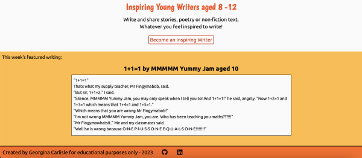

##### New User Navigation

##### Developer links (footer)

Every page contains a footer with my name and contact links, as the developer who created this platform, and the year the platform was created. On larger screens extra info is given to say that the platform was created for 'educational purposes only'.
Clear and easy to access links to take the user to my LinkedIn and GitHub with links opening in a new tab (user story 7).

##### Information For Parents

Parents of new users can read about how the platform works, the steps in place to protect their child and what they and their child can do to increase safety (user story 4).
This information:

- can be accessed directly from the main navigation

- can also be accessed as a link from the sign-up page, where parents are asked to give their consent.

- opens up in a modal so that it can always be accessed without disrupting anything esle taking place, such as filling in the sign-up form.

- has a title and navigation link making it clear the information is targeted towards parents.

- has an introduction that quickly explains what information is contained in the section.

- is split into clear sections each with a title and picture.

- has been style to make it easy to scan and pick out information of interest.

- has a clear back button can be used to re-hide the information.

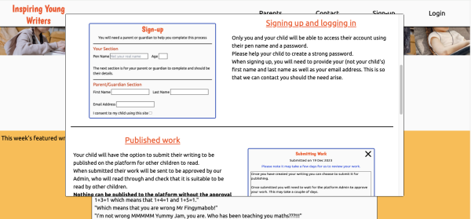

##### Contact Us

Parents of a new user can contact the site admin so that they can raise any concerns or ask any questions about the platform (user story 5) with the details they enter in the form being directly emailed to the site owner (user story 6).

The contact form:
- can be navigated to intuitively and easily from the main nav and also from links within the sign-up form and parent information.
- has clear labels indicating the information to be added to each input field.
- A clear submit button.
- Clear prompts are given should the form not be correctly completed.
- A clear success message is given upon submission of the form.

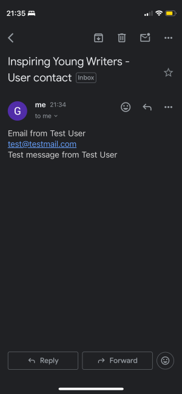

##### Error Pages

New users are informed when page link errors occur and provided with a link straight back to the landing page (user story 8).

Attempting to access a webpage that does not exist, has been moved, or has a dead or broken link takes them to a 404 page.

They are taken to an error 500 page if the server encounters an unexpected condition that prevented it from fulfilling the request.

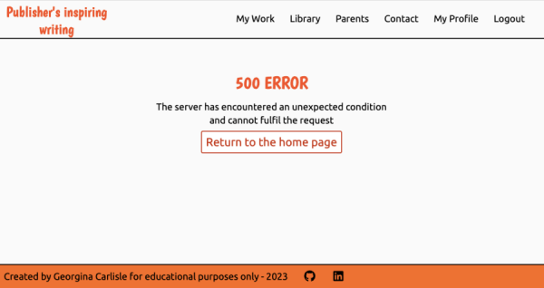

#### Authentication EPIC

##### Sign - up

New users can sign-up and become registered users (user story 9). As this site is for children aged 8 - 12, the sign up process also involves their parent/guardian (user story 10).

Key features:
- Clear link to the sign-up page in the header.
- Call to action on the landing page also links to the sign-up page.
- A clear title and instructions are provided to help users navigate the sign-up process.
- The user is clearly informed they will need their parent/guardian to help them sign up.
- The sign-up form is split into clear sections, so that it is obvious which parts need to be filled in by a parent/guardian.
- The parent/guardian is asked to provide their contact details and consent before their child can sign up.
- Clear labels indicate the information to be added to each input field.
- Clear prompts are provided when the form has not be filled in correctly.
- Clear feedback lets the user know they have successfully signed up.
- On signing-up users are redirected to the account_home page.

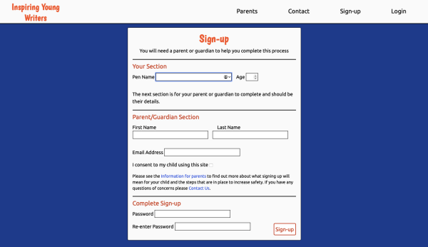

##### Login

Registered users can use their pen name and password to login to their account (user story 11).

Key features:
- Clear link to the login page in the header.
- Clear title and instructions to help the user navigate the login process.
- Clear labels indicate the information to be added to each input field.
- Clear prompts are provided when the form has not be filled in correctly.
- Clear button to login.
- Clear success message on successfully logging in.
- On logging in the user is redirected to the account_home page.

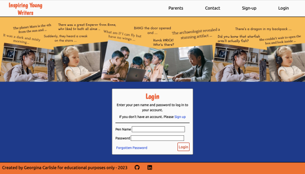

##### Logout

Logged in users can easily and intuitively log out of their account (user story 12).

Key features:
- Clear link to logout in the account_header.
- Clear success message on logging out.
- On logging out the user is redirected to the home page.

##### Forgotten Password

Registered users who have forgotten their password can reset it (user story 13).

Key features:
- The login page has a clear link for 'Forgotten Password'.
- Clicking on 'Forgotten Password' takes the user to a 'Password reset' page where they can enter the email address linked to their account.
- A clear success message lets them know that an email to reset password has benn sent.
- The email contains a link that takes them to a form to reset my password.
- On reseting their password they receive a success message with a link to login.

#### Account Home EPIC

##### Account Home Page

Once logged in users are taken to their account home page (user story 19). This is also where they are returned should they:
- try to access the landing page when logged in.
- try to access a page they don't have permission for. They are also given a message should this happen.

Key features:
- A clear title welcomes me to my account
- Clear buttons to take me straight to important areas of the site.
- The page cannot be accessed unless logged in. Trying to do so will redirect you to the login page.

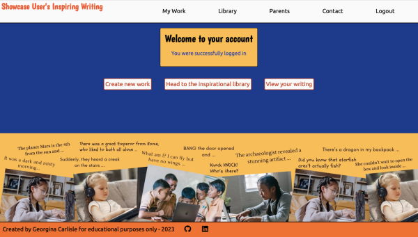

##### Account Navigation

##### Parent information

Parent information can also be accessed when logged in (user story 22)

##### Contact

The contact us form can also be accessed when the user is logged in. However, when logged in users won't need to add in a name or email address as this will be automatically generated from their user details, making the process easier for users but also clearly linking the message sent with the logged in user making it easier for the admin to then look into any issues.

##### Error Pages

Logged in users are informed when page link (404) or server (500) errors occur and provided with a link straight back to their account home page (user story 21).

#### My Work EPIC

##### My Work

Logged in users can navigate to a page where all their work is listed by status (user story 24).

Key features:
- 'My work' link in the main navigation.
- 'View my work' link from call to action button on the account home page.
- Title shows the user that they are in the 'My Work' section of the platform.
- The users work is listed by category: published work, work awaiting approval, drafts and if there is any Submitted work that does not meet publishing requirements.
- Clicking on the title of a piece of writing will bring it up to view (published and awaiting approval) or edit (draft and submitted work that does not meet publishing requirements)
- A clear button takes the user to the create writing page.
- This page cannot be accessed unless logged in (directed to login page) and users cannot accidentally access someone else's work (directed to account home with a message).

##### Create work

Users can create a piece of writing (user stories 26, 27 and 30):
- From the account home page there is a clear button that takes them directly to a page for creating work.
- From the my work page there is also a clear button that takes them directly to a page for creating work.
- The title and placeholder text help users navigate the process of creating new work.
- There are two clear buttons. One for submitting the work and one for saing it as a draft.
- Feedback is given to ensure the form is filled in correctly.
- Confirmation is sort before work is submitted to be published.
- A success message is given on saving as draft or submitting to be published.
- The user is redirected to the my work page.
- A back button allows users to return to the my work page, confirmation is sort to ensure work is not left unsaved.

##### View work

Users can click on an item of 'published work' or 'work awaiting approval' and view it (user stories 31 and 32).

Key features:
- 'title', 'date published' or 'date submitted' and 'writing' all displayed and easy to read
- A back button (x) to return to 'My Work'
- For work awaiting approval, two clear options: 'edit writing' and 'delete writing'.
- For published work, three clear options:
'edit writing', 'delete writing' and 'view feedback'.

##### View feedback for my work

##### Edit work

Users can click to edit their work (user stories 32, 33 and 53). 

Key features:
- Clicking on 'draft work' or 'work not meeting publishing requirements' automatically brings it up in the edit view.
- For published work and work awaiting approval a clear button to edit is present when viewing the work.
- The work to be edited is displayed in a form.
- A title and introduction (unique to status of work) help users to navigate the process of editing their work.
- There are three clear options - save draft, submit for publishing, delete writing
- Submit for publishing and delete writing both bring up a conformation step.
- An x in the top right of the container takes the user back to 'My Work' after confirming there are no changes needing saving.

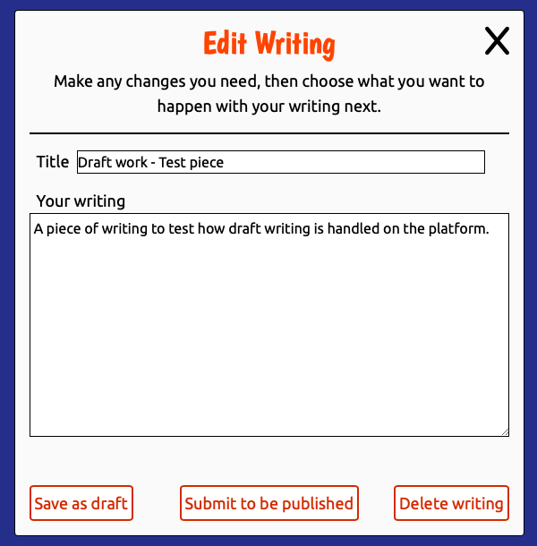

##### Delete work

Users can click to delete their writing (user story 34).

Key features:
- The option to delete can be found when viewing or editing writing.
- Clicking to delete brings up a confirmation step.
- On choosing to delete the writing is deleted and the user is returned to 'My work' with a success message.

#### Library of Published Work EPIC

##### Library of inspiration

Logged in users can view published work from other users (user story 40).

Key features:
- A clear link to the library is provided in the main navigation.
- A clear link to the library is provided as a call to action button on the account home page.
- A title shows users that they are in the 'Library of inspiration' section of the platform.
- A list shows all published work with most recent first.
- For each piece of work the 'title', 'author', 'age of author' and 'date published' are given.
- Clicking on the title brings the writing up so that it can be read.
- In the read view clicking the x will take the user back to the library.

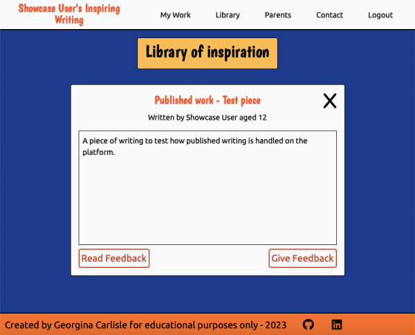

#### Feedback EPIC

##### View feedback

##### Give feedback

Logged in users can give feedback on published work (user story 46).

Key features:
- When reading published writing in the library there is a clear button to 'Give Feedback'.
- Clicking 'Give Feedback' brings up a form to submit feedback.
- The form title and introduction help users to navigate the process of submitting feedback.
- Sentence starters help users to submit positive and constructive feedback.
- There is a clear button to submit feedback.
- Clear prompts ensure the form is correctly filled in.
- On clicking the submit button, users are asked to confirm that I would like to submit my feedback.
- Clear feedback is given to users on successfully submitting feedback.
- On submission of feedback users are redirected back to the library of inspiration.
- Feedback cannot be given to yourself.
- Feedback can only be given once.

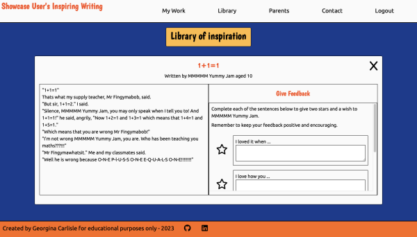

##### Edit feedback

##### Delete feedback

#### ADMIN (covers Approval of writing EPIC plus more)

The site admin can:
- delete users and all their associated writing and feedback (user story 17)
- approve writing to be published, no writing is viewable to other users until approved by the admin (user story 35)
- approved status can be removed at any time (user story 39)
- write a message to be displayed to a user explaining why their writing has not been approved (user story 37)
- delete an instance of writing
- approve feedback to be published, no feedback is viewable to other users until approved by the admin. Approved satatus can be removed at any time (user story 75)
- delete an instance of feedback (user story 59)
- locate the parent details for a user in order to directly contact the parent/guardian should need arise (user stories 18, 38, 60)

[Return to contents list](#contents)

### Future Features

#### New User Experience

On the landing page, a section below the featured writing will be added to give futher information about the platform. This covers user story 3:

"As a new user I am given clear information on what registered users can do, so that I know what signing up will allow me to see and do."

#### Tips and ideas

Throughout the logged in user side of the platform will be tips and ideas to aid the user. These will be presented as small images that will also make the platform visually more appealing. These will be added to the:
- account home page (user stories 20, 25)

#### Profile control

Currently users can create an account, but cannot then edit or delete their user details. A future feature of the platform will be a profile page that would allow users to edit their details and/or delete their account. This covers user stories 14, 15 and 16:

"As a signed-in user I can edit my profile so that I can update my details."

"As a signed-in user I can delete my account, so that I can remove all my contributions and details from the platform should I wish."

"As the parent of a registered user I am informed of any profile changes my child makes and my consent to any changes is required, so that I can continue to support my child."

These user stories were left for future development of the project due to time constraits and the need to prioritise other features. Should a user wish to delete their details then they will be able to directly contact the site owner via the contact form, with the site owner then being able to remove their account via the admin interface.

#### Admin interface

The current admin interface is the default interface provided by Django with only very basic customisation. In future a custom interface will be built making it easier for the admin to carry out their tasks as well as adding further functionality to automise some of the processes. This has been left for future development due to the large amount of work needed to achieve this and the small initial gain when the platform has very few users.

[Return to contents list](#contents)

## Languages

HTML
CSS
JavaScript
Python

[Return to contents list](#contents)

## Frameworks and Libraries

[Django 3.2](https://www.djangoproject.com) - A high-level Python web framework that encourages rapid development and clean, pragmatic design.

[Gunicorn 21.2](https://gunicorn.org) - A Python WSGI HTTP Server for UNIX.

[Psycopg2 2.9](https://www.psycopg.org/docs/#) - A PostgreSQL database adapter for the Python programming language.

[Tailwind CSS](https://tailwindcss.com/) - A utility-first CSS framework.

## Tools and Technologies

Tools and technologies are listed in order of use during the development of this project.

[Code Institute Template](https://github.com/Code-Institute-Org/ci-full-template) - Provided me with a familiar base from which to build my project.

[GitHub](https://github.com/) - Stores the repository for this project so that it can be viewed by others.

[git](https://git-scm.com/) - Controlled the building of this project in a series of versions which can be tracked.

[Visual Studio Code](https://code.visualstudio.com/) - One of the two editors in which this project has been built. The following extentions were installed and used: Markdown Preview Enhanced, Python, Pylance, Tailwind CSS IntelliSense

[Drawio](https://www.drawio.com) - Used to visually plan out the structure of the platform and how the user will be able to move through it.

[LucidChart](https://www.lucidchart.com/pages/) - Used to plan the models to be included in the database and how they connect together.

[Balsamiq](https://balsamiq.com) - Used to create wireframes showing the skeleton plane of the design phase.

[Cloudinary](https://cloudinary.com) - Image and video API platform.

[Heroku](https://www.heroku.com) - Used to host and deploy the project.

[ElephantSQL](https://www.elephantsql.com) - Used to store the PostgreSQL database.

[Canva](https://www.canva.com) - Used to create the hero image.

[Adobe](https://color.adobe.com/create/color-wheel) - Used to create the image showing the colour scheme.

[WebAim contrast checker](https://webaim.org/resources/contrastchecker/) - Used to test contrast between text and background.

[Code Anywhere](https://app.codeanywhere.com/) - One of the two editors in which this project has been built.

[ChatGPT](https://chat.openai.com/) - ChatGPT was used to help resolve project bugs. This has then been clearly referenced in [Bugs and Fixes](#bugs-and-fixes). ChatGPT was also used on occasion to speed up the development process and provide ideas and support in achieving certain requirements. This has then been clearly referenced in [Acknowledgements](#acknowledgements).

[Jshint](https://jshint.com/) - Used to validate the JavaScript code.

[Return to contents list](#contents)

## Testing and Validation

See [TESTING.md](TESTING.md) for all testing and validation

## Bugs and Fixes

| # | Bug | What was tried | Fix |
| --- | --- | --- | --- |
| 1 | Tailwind CSS working locally, but not being served on the deployed site. | Research into Tailwind and Django. Research into Tailwind and Heroku. Tested different methods of installing Tailwind. Tried various fixes to deploy through Heroku. Went back to basics. Found advice from slack community around Heroku and static files. Worked back through changes, which changes were needed and which weren't. | Followed [Tailwind CSS Django - Flowbite](https://flowbite.com/docs/getting-started/django/) to install Tailwind with css files stored in best location. Set DISABLE_COLLECTSTATIC to 0 on Heroku. Specific Deployment Branch with Debug to False and compress removed (base.html and settings.py). Run the command **./manage.py collectstatic** prior to deployment. |
| 2 | Contact form textarea automatically renders with 16 whitespace characters | This is the repeat of a bug from my first project and numerous google searching once again led to no answers. Problem inputted into ChatGPT which then located the error. | The way I had formatted the code with the close tag of the textarea element on the line below the open tag was leading to the error. Placing the close tag directly after the open tag resolved the error. |
| 3 | On contact form submission the following error displays: SMTP.starttls() got an unexpected keyword argument 'keyfile' | [Research](https://stackoverflow.com/questions/77482831/smtp-starttls-got-an-unexpected-keyword-argument-keyfile) found which I thought suggested Django version was the issue. Django updated causing postgresql to need updating which caused the project to fully cease working. Tutor support contacted and python version identified as root cause. | Python version updated to 3.9.17 |
| 4 | When working locally using VScode and trying to runserver I encountered the following error messages: 'python3(29793,0x70000e8e1000) malloc: *** error for object 0x82: pointer being freed was not allocated', 'python3(29793,0x70000e8e1000) malloc: *** set a breakpoint in malloc_error_break to debug' | Initial research led to suggestions about X-code, which I am unable to install on this laptop. Decision to move to using CodeAnywhere, where the project ran without issue. I then followed a suggestion from the CI slack community to switch to using psycopg2-binary. Installing latest psycopg2-binary caused errors as it wasn't compatible with older postgresql. So I used Psycopg2-binary version 2.8.6 and everything worked in VScode without incident. However, issues were then faced when deploying through Heroku and I reverted to Psycopg2 | Finally, in working to solve bug 5 and changing code in settings.py to point to SQlite db and not ElephantSQL database, error was resolved. However, error returns when switching to point to ElephantSQL database at any point. CodeAnywhere used on occasions when this was needed. |
| 5 | When attempting to delete a user from the admin panel I faced the following error: IntegrityError at /admin/users/user/ insert or update on table "django_admin_log" violates foreign key constraint "django_admin_log_user_id_c564eba6_fk_auth_user_id" DETAIL: Key (user_id)=(4) is not present in table "auth_user". | I spent time exploring and gaining an understanding of the error using google searches and chatGPT. This led me to the belief that maybe the django_admin_log was built prior to me referencing my custom user model within settings.py and therefore when attempting to delete a user in the admin panel the admin_log can't find the details because it is looking in the wrong place (the default auth_user table). I then contacted Tutor support for guidance on how best to solve this issue. | With support from a CI tutor I changed settings.py code to point at the SQlite db, deleted all migrations, deleted and reinstated the SQlite db, ran migrations and linked up a new ElephantSQL databse. |
| 6 | In the password_reset_form, attempting to render the username of account being reset resulted in 'AnonymousUser' rather than the user's username. | Explored the files within Django that were connected with the password reset process. Used google searches and chatGPT. Tried different ways of accessing the username (user, user.username, request.user). | Due to time constraints and this not being of high importance the attempt to render the user's username was removed. |

[Return to contents list](#contents)

## Deployment

[Return to contents list](#contents)

## Credits

### Code

[Code Institute](https://codeinstitute.net) - "I think therefore I Blog" walkthrough followed when installing dependencies and deploying to Heroku.

[BroBonds](https://github.com/GeorginaCarlisle/brobonds-movember-hackathon) - Heavily influenced how I chose to structure the apps, folders and files in this project. It was also used as a reference point when creating views.

[How To Send Email With Django by Codemy.com](https://www.youtube.com/watch?v=xNqnHmXIuzU) - Youtube tutorial followed and adapted so that on submission of the contact us form an email is sent to the site owner.

[Custom User Model with email login (DJANGO) by CodingWithMitch](https://www.youtube.com/watch?v=SFarxlTzVX4) - Youtube tutorial followed and adapted in order to create the User model and associated CustomAccountManager.

[Register New Users with Django Custom User by CodingWithMitch](https://www.youtube.com/watch?v=sbCd52JiCU4) - Youtube tutorial followed and adapted in order to create NewUserForm and sign_up_view.

[Login and Logout with Django by CodingWithMitch](https://www.youtube.com/watch?v=5qhlDC_bQsA) - Youtube tutorial followed and adapted in order to create LoginForm, login_view and logout_view.

[ChatGPT](https://chat.openai.com/) - Code for adding a custom error message when the 'unique' requirement is not met in the CreateWritingForm was copied and adapted from an example given by chatGPT.

[ChatGPT](https://chat.openai.com/) - The functions 'get' and 'get_context_data' within the class Index (the view rendering the landing page) were copied and adapted from example code given by chatgpt when searching for a way to ensure that the context data I had generated (featured writing) would be passed through and used in the rendering of index.html.

[ChatGPT](https://chat.openai.com/) - Code for validation against swear words copied and adapted slightly from an example given by Chatgpt. Used in the CreateWritingForm, NewUserForm and GiveFeedbackForm.

[Password Reset and Password Change (Django) by CodingWithMitch](https://www.youtube.com/watch?v=W5PyXUTjwS4) - Youtube tutorial followed in order to create password reset functionality. Associated url paths in the main urls file were copied and adapted. Templates in the password_reset folder were created while following along to the tutorial.

[Favicon](https://favicon.io/emoji-favicons/pencil/) - Code used to link to Favicon images copied from here with href attributes adapted.

### Images

The following images were used to create the hero image displayed on all New User Experience pages and the account home page. The images were combined using [Canva](https://www.canva.com) with back ground and text added by myself.

- [boys-using-silver-macbook](https://www.pexels.com/photo/boy-using-silver-macbook-indoors-3401403/) by Agung Pandit Wiguna.

- [girl-watching-movie-on-laptop](https://www.pexels.com/photo/little-girl-watching-movie-on-laptop-4017428/) by Gustavo Fring.

- [girl-typing-on laptop](https://www.pexels.com/photo/focused-asian-girl-typing-on-laptop-at-home-5905969/) by Katerina Holmes.

- [young-woman-sitting-on-the-carpet-while-using-laptop](https://www.pexels.com/photo/a-young-woman-sitting-on-the-carpet-while-using-her-laptop-5998826/) by cottonbro studio.

[Favicon](https://favicon.io/emoji-favicons/pencil/) from Favicon.io where the emoji graphics are from the open source project [Twemoji](https://twemoji.twitter.com). The graphics are copyright 2020 Twitter, Inc and other contributors. The graphics are licensed under [CC-BY 4.0](https://creativecommons.org/licenses/by/4.0/).

### Font

[Boogaloo](https://fonts.google.com/specimen/Boogaloo) - John Vargas Beltram

[Ubuntu](https://fonts.google.com/specimen/Ubuntu) - by Dalton Maag

[Ubuntu-Mono](https://fonts.google.com/specimen/Ubuntu+Mono) - by Dalton Maag

### Icons

[Font Awesome icons](https://fontawesome.com/) - Used for the mobile nav and also in the footer.

### Platform content

All platform content has been generated either by myself as 'Publisher' or by family and friends using the site.

[Return to contents list](#contents)

## Acknowledgements

Family and friends - Completing this project would not have been possible without the support of my family and friends. Family members and friends also took time to become registered users and create real content for the platform.

[Code Institute](https://codeinstitute.net) - The majority of the coding skills, knowledge and understanding showcased in this project have been learnt through the 'Diploma of Full stack software development' that I am completing with Code Institute.

Code Institute's Slack community - Provided me with support and key insight into issues I was facing. Specific support was gained in solving [bug #1](#bugs-and-fixes). 

Code Institute's Tutor support - Helped me to solve [bugs #3 and #5](#bugs-and-fixes).

My mentor Gurjot - Provided support and guidance during this project.

[Django's documentation](https://docs.djangoproject.com/en/3.2) - Used throughout this project to check how to correctly use Django's inbuilt functions and models etc.

### Other projects

I spent time looking at Django projects created by other students and how they utilised Django, the information contained in their readme and the testing they completed. This aided my understanding of the Django framework as well as providing a reference for good documentation and testing. Any code directly copied or which has heavily influenced my code has been mentioned in [Credits](#credits).

[BroBonds](https://github.com/GeorginaCarlisle/brobonds-movember-hackathon) - A Django blog and event style project created by Team!Alone of which I was a team member.

[Tailor's Thimble](https://github.com/MoniPar/tailors_thimble) - A fictional business website created by MoniPar.

[Tribe](https://github.com/adamgilroy22/tribe) - A social media application created by Adam Gilroy.

[Knowledge Flow](https://github.com/rockroman/CI_PP4-Knowledge-Flow) - A learning and blogging application created by RockRoman.

[Dome Restaurant](https://github.com/christiangoran/dome-restaurant-repo) - A restaurant booking website created by Christian Goran.

[AutoMarket](https://github.com/Dayana-N/AutoMarket-PP4) - A listing site for selling cars created by Dayana-N.

### Websites, articles and tutorials

The following websites, articles and tutorials are listed in order of use during the development of this project.

[Conventional Commits](https://www.conventionalcommits.org/en/v1.0.0/) - I followed the structure given in this article for my commit messages.

[Using Git - how to go back to a previous commit](https://medium.com/swlh/using-git-how-to-go-back-to-a-previous-commit-8579ccc8180f) - I followed this article when reverting to a previous commit.

[Tailwind CSS Django - Flowbite](https://flowbite.com/docs/getting-started/django/) - Instructions in article followed to install tailwind css and used in fix for bug 1.

[Tailwind CSS Tutorial #6 - Custom Fonts by Net Ninja](https://www.youtube.com/watch?v=arfDRUIZOiw) - Instructions in video followed to create custom font family styles.

[Innovation-Creativity](https://www.innovation-creativity.com/colors-that-inspire-creativity/) - This article provided inspiration for the colour scheme used on the platform.

[Python / Django - How to create regex (RegexValidator) which allows only letters and spaces?](https://stackoverflow.com/questions/33334907/python-django-how-to-create-regex-regexvalidator-which-allows-only-letters) - This StackOverflow question provided me with a context in which to understand how to use the RegexValidator.

[How to Easily Style Your Django Form Fields With Django Widget Tweaks by Pretty Printed](https://www.youtube.com/watch?v=ynToND_xOAM) - This tutorial gave me some insight into how to add widgets to provide classes to my form input fields.

[Password Reset Email | Django (3.0) Crash Course Tutorials (pt 20) by Dennis Ivy](https://www.youtube.com/watch?v=sFPcd6myZrY) - Youtube tutorial watched in order to assist in getting the password reset functionality working

### ChatGPT

Throughout the development of this project I have pushed beyond the knowledge gained from my course with Code Institute, initially utilising google searches to find articles and tutorials (acknowledged above) and time spent searching through and reading the Django documentation to aid my learning and allow me to include features I did not have the knowledge and skill to write the code needed at the beginning of this project, but do now.
This was often a very time consuming process and so in my third iteration I explored how I could use chatgpt to aid my learning and thus speed up the development of the project.

Where I have directly used example code provided by chatgpt this has been credited in [Credits](#credits). Where I have utilised chatgpt in the solving of bugs, this has been acknowledged in [bugs and fixes](#bugs-and-fixes). All other instances where I have used chatgpt to aid my learning and in turn the building of this project are covered below with a clear description of what I gained from Chatgpt. 

[Chatgpt](https://chat.openai.com/):

- Pointed me towards slugify as a way to create a slug, including aiding my understanding by giving an example of use. I then used this understanding when creating a variable for the slug field in create_writing_view and passing this variable into the model in CreateWritingForm.

- Provided ideas for how to create a confirmation step when submitting writing to be published. I further explored the initial ideas given (drawing on my own knowledge as well as responses back from chatgpt and Django's documentation) arriving at a final decision to use a combination of view code and html code utilising messages, context, if statements and adding '?confirm=True' into the url of the form action. Final code was written by myself, utilising the knowledge and understanding gained with no code being copied. The initial code written can be seen in create_writing.html and create_writing_view. This code was then used to influence all other instances where confirmation was needed.

- Provided confirmation that you can program two submit buttons for a form and an explantion of how you could give the submit buttons each a unique name, which could then be checked by the view code to see if that name was in the post request. Two submit buttons were used in create_writing.html linking with create_writing_view. This code was written by myself drawing on the knowledge gained from chatgpt.

- Pointed me towards the date filter (|date:"d M Y") as a way to pull just the date from a datetimefield, including providing an example of use. I then used this knowledge when rendering the date in my_work.html.

- Provided me with an explanation of the attributes that are part of the ModelAdmin class and what they can be used for. I then used this knowledge when writing my admin files in order to customise the Admin interface.

- Provided tips for improving accessibility where I have elements with event listeners that open and close modals - mobile nav and parent information. I then used the knowledge gained to go back into my code and add aria-label and aria-hidden attributes where I felt they were needed.

- Pointed me towards using "|linebreaksbr|safe" to render the contents of my TextField with linebreaks intacted. I then used this knowledge when rendering the body field of an instance of writing in view_writing.html and read.html.

[Return to contents list](#contents)
