# Testing and Validation

## Contents

[Code Validation](#code-validation)

[User Story Testing](#user-story-testing)

[Form validation Testing](#form-validation-testing)

[Accessibility Testing](#accessibility-testing)

[Lighthouse](#lighthouse)

[Responsive Testing](#responsive-testing)

[Compatibility Testing](#compatibility-testing)

## Code Validation

### HTML Validation

The [Nu Html Checker](https://validator.w3.org/nu/) was used to validate all html code with the results shown in the table below. In order to test the final generated html code, chrome dev tools was utilised to show the source code for the page currently being viewed with this code then being copied and checked using the validator. Screenshots have only been taken where the validator showed warnings or errors.

| App/folder | HTML file | Result | Extra notes |
| --- | --- | --- | --- |
| templates | base.html | PASS | Tested as part of the landing page |
| | footer.html | PASS | Tested as part of the landing page |
| | header.html | PASS | Tested as part of the landing page |
| | account_header.html | | |
| | 404.html | PASS | |
| | hero.html | PASS | Tested as part of the landing page |
| | parent_info.html | PASS | Tested as part of the landing page |
| templates/password_reset | password_reset.html | PASS | |
| | password_reset_sent.html | PASS | |
| | password_reset_complete.html | PASS | |
| | password_reset_form.html | PASS | |
| home | index.html | PASS | |
| | contact.html | PASS | |
| users | signup.html | PASS | |
| | login.html | PASS | |
| account | account_home.html | PASS | |
| | account_contact.html | PASS | |
| writing | create_writing.html | PASS | |
| | my_work.html | PASS | |
| | edit_writing.html | PASS | |
| | view_writing.html | PASS | |
| | view_my_feedback.html | | |
| library | library.html | PASS | |
| | read.html | PASS | |
| | give_feedback.html | PASS | |
| | read_feedback.html | PASS | |
| | edit_feedback.html | PASS | |

#### HTML warnings

Include screenshots of any warnings here

### CSS Validation

### JavaScript Validation

No errors or warnings when script.js passed into [Jshint](https://jshint.com/):

### Python Validation

Each individual pythoon file created or edited by me has been passed through the [CI Python Linter](https://pep8ci.herokuapp.com/). All results are recorded below. Screenshots have only been taken where the Linter has brought up warnings/errors.

| App/folder | Python file | Result | Extra notes |
| --- | --- | --- | --- |
| inspiringyw | settings.py | Two errors | See below for further details |
| | urls.py | PASS | |
| | views.py | PASS | |
| home | urls.py | PASS | |
| | views.py | PASS | |
| users | admin.py | PASS | |
| | forms.py | PASS | |
| | models.py | PASS | |
| | urls.py | PASS | |
| | views.py | PASS | |
| account | urls.py | PASS | |
| | views.py | PASS | |
| writing | admin.py | PASS | |
| | forms.py | PASS | |
| | models.py | PASS | |
| | urls.py | PASS | |
| | views.py | PASS | |
| library | admin.py | PASS | |
| | forms.py | PASS | |
| | models.py | PASS | |
| | urls.py | PASS | |
| | views.py | PASS | |

#### Python warnings

Testing of settings.py generated:
- a 'E501 line too long (80 > 79 characters)' error for line 146. I searched for ways to reduce this line length but attempts to split up the string 'cloudinary_storage.storage.StaticHashedCloudinaryStorage' lead to errors when running the program as it was then unable to correctly link to cloudinary.
- a 'E501 line too long (86 > 79 characters)' error for line 103. Initial attempts to split up the string 'django.contrib.auth.password_validation.UserAttributeSimilarityValidator' lead to a 500 error when navigating to the sign-up page. I was unable to find an alternative solution for shorting the line length.

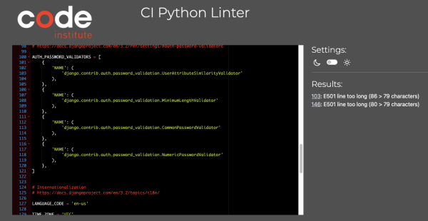

[Return to contents list](#contents)

## User Story Testing

The acceptance criteria for each user story has been checked on completion (1st Check) and then re-checked during the final testing stage.

| # | User Story | Acceptance Criteria | 1st Check | Final Check |
| -- | ---- | ---- | -- | -- |
| 1 | As a **new user** the website is clearly geared towards children age 8 - 12 and sharing writing | I am drawn to a clear title "Inspiring Young Writers aged 8 - 12" | PASS | PASS |
| | | A hero image shows children at laptops creating stories and poems | PASS | PASS | 
| | | The platform name "Inspiring young writers" is clearly displayed on the left of the nav bar | PASS | PASS |
| | | A short introduction tells me exactly what the platform is for. | PASS | PASS |
| 2 | As a **new user** I can read work written by another child | When first landing on the site I can read a piece of published writing from the platform | PASS | PASS |
| | | The writing is displayed directly under the platform title and call to action, so that I don't miss it | PASS | PASS |
| | | Only writing specifically chosen to be featured is displayed | PASS | PASS |
| | | The writing is referenced under a heading 'This week's featured article:' | PASS | PASS |
| | | The writing includes title, author, author's age and the writing | PASS | PASS |
| 3 | As a **new user** I am given clear information on what registered users can do | Future Feature | | |
| 4 | As the **parent of a new user** I am provided with information which details how the site works | I can navigate to 'Information for parents' from the navigation bar | PASS | PASS |
| | | I can navigate to 'Information for parents' from the sign-up page | PASS | PASS |
| | | 'Information for parents' available across the full platform | PASS | PASS |
| | | 'Information for parents' opens up in a modal | PASS | PASS |
| | | A title makes it clear the information is targeted towards parents | PASS | PASS |
| | | An introduction quickly explains what information is contained in this section | PASS | PASS |
| | | The information is split into clear sections each with a title and picture | PASS | PASS |
| | | The layout and styling of the information makes it easy to scan and pick out information of interest | PASS | PASS |
| | | A clear back button can be used to re-hide the information | PASS | PASS |
| 5 | As the **parent of a new user** I can contact the site admin | I can navigate intuitively and easily to the contact page | PASS | PASS |
| | | The design of the page is pleasing to the eye and doesn't distract | PASS | PASS |
| | | The title and introduction reassure me as to what the form is for | PASS | PASS |
| | | Clear labels indicate the information to be added to each input field | PASS | PASS |
| | | The button to submit is clear | PASS | PASS |
| | | When entering the wrong information I am prompted and informed what needs to be entered | PASS | PASS |
| | | I am given clear success feedback on submission of the form | PASS | PASS |
| 6 | As the **site admin** user's question and concerns along with their contact details are passed to me | Submitted contact us data emailed to the site owner | PASS | PASS |
| 7 | As a **new user** I am provided with the name and contact links for the developer who created this platform | The name of the developer and year platform created are clearly visible at the bottom of every page. | PASS | PASS |
| | | On larger screens extra info is given to say that the platform was created for 'educational purposes only'. | PASS | PASS |
| | | Clear and easy to access links to take the user to the developer's LinkedIn and GitHub. | PASS | PASS |
| | | Clicking on links open relevant page in new tab. | PASS | PASS |
| 8 | As a **new user** I am informed when page link errors occur and provided with a link straight back to the landing page | Attempting to access a webpage that does not exist, has been moved, or has a dead or broken link takes me to a 404 page | PASS | PASS |
| | | I am taken to an error 500 page if the server encounters an unexpected condition that prevented it from fulfilling the request | PASS | PASS |
| | | Both pages provide links back to the platform | PASS | PASS |
| 9 | As a **new user** I can easily set up an account | I can navigate intuitively and easily to the sign-up page | PASS | PASS |
| | | The landing page contains a call to action providing a direct and clear link to sign-up | PASS | PASS |
| | | The design of the page is pleasing to the eye and doesn't distract | PASS | PASS |
| | | The title and clear instructions help me to navigate the sign-up process | PASS | PASS |
| | | It is clear which part of the form is for the child and which is for the parent | PASS | PASS |
| | | Clear labels indicate the information to be added to each input field | PASS | PASS |
| | | The button to sign-up is clear | PASS | PASS |
| | | When entering the wrong information I am prompted and informed what needs to be entered | PASS | PASS |
| | | I am given clear feedback to let me know I have successfully signed up | PASS | PASS |
| | | On signing-up I am redirected to the account_home page | PASS | PASS |
| 10 | As the **parent of a new user** I am asked to input my name and email address and give consent for my child joining the site | When signing up to the platform, my child is informed that they will need me to sign up | PASS | PASS |
| | | I am asked to provide my name, email address and consent before my child can sign up | PASS | PASS |
| 11 | As a **registered user** I can use my pen-name and password to login to my account | I can navigate intuitively and easily to the login page | PASS | PASS |
| | | The design of the page is pleasing to the eye and doesn't distract | PASS | PASS |
| | | The title and clear instructions help me to navigate the login process | PASS | PASS |
| | | Clear labels indicate the information to be added to each input field | PASS | |
| | | The button to login is clear | PASS | PASS |
| | | When entering the wrong information I am prompted and informed what needs to be entered | PASS | PASS |
| | | I receive a clear message to let me know I have successfully logged in | PASS | PASS |
| | | On logging in I am redirected to the account_home page | PASS | PASS |
| 12 | As a **signed-in user** I can easily logout of my account | I can logout out easily and intuitively | PASS | PASS |
| | | I am given clear success feedback on logging out of my account | PASS | PASS |
| | | On logging out I am redirected to the home page | PASS | PASS |
| 13 | As a **registered user** (with the help of my parent) I can reset my password using a link sent to my parent’s email | The login page has a clear link for 'Forgotten Password' | PASS | PASS |
| | | Clicking on 'Forgotten Password' takes me to a 'Password reset' page where I can enter the email address linked to my account | PASS | PASS |
| | | On submitting I am taken to a success message | PASS | PASS |
| | | I also receive an email with a link to reset my password | PASS | PASS |
| | | Clicking on the link takes me to the platform and a form to reset my password | PASS | PASS |
| | | On reseting my password I receive a success message with a link to login | PASS | PASS |
| 14 | As a **signed-in user** I can edit my profile | | | |
| | | | | |
| 15 | As a **signed-in user** I can delete my account | | | |
| | | | | |
| 16 | As the **parent of a registered user** I am informed of any profile changes my child makes and my consent to any changes is required | | | |
| | | | | |
| 17 | As the **site admin** I can remove accounts | As a site admin I can log in to the admin side of the site | PASS | PASS |
| | | I can click to bring up a list of all registered users | PASS | PASS |
| | | I can click to delete a selected user | PASS | PASS |
| | | I am asked to confirm this action before it will be carried out | PASS | PASS |
| 18 | As the **parent of a registered user** I am informed via email if my child’s account has been removed including the reason why | As site Admin I can handle this manually | PASS | PASS |
| | | When deleting a user account I can see all the details I need: email address, first name and last name of the parent or guardian | PASS | PASS |
| 19 | As a **signed-in user** user once logged in I am taken to a home page for my account | The top left of the nav bar lets me know I am signed in to my account with wording unique to me "Pen name's inspiring writing" | PASS | PASS |
| | | The navigation bar provides links to all the registered user features |  PASS | PASS |
| | | It is easy and intuitive to navigate through the available features | PASS | PASS |
| | | A clear title welcomes me to my account | PASS | PASS |
| | | There are clear buttons to take me straight to important areas of the site | PASS | PASS |
| | | The page cannot be accessed unless logged in | PASS | PASS |
| 20 | As a **signed-in user** I am provided with tips on how I can use the platform when I first log in to my account | Future Feature | | |
| 21 | As a **signed-in user** I am informed when page link errors occur and provided with a link straight back to my account home page | When I am logged in the link from the 404 and 500 pages takes me back to my account_home page | PASS | PASS |
| 22 | As the **parent of a signed-in user** I can also access the information for parents when my child is logged in | 'Parent' link is available when logged in as well as when not | PASS | PASS |
| | | Clicking on 'Parent' in the header brings up the parent information | PASS | PASS |
| 23 | As the **parent of a signed-in user** I can also contact the site admin when my child is logged in | I can easily navigate to the contact page when logged in | PASS | PASS |
| | | I do not need to add in my name or email address as this can be gained from my user data | PASS | PASS |
| | | A clear message explains this | PASS | PASS |
| 24 | As a **signed-in user** I can navigate to a page where all my work is listed by status | I can navigate to my work from the navigation bar | PASS | PASS |
| | | I can navigate to my work from a call to action button on my account home page | PASS | PASS |
| | | A title shows me that I am in the 'My Work' section of the platform | PASS | PASS |
| | | I am shown a list of all my saved work | PASS | PASS |
| | | The list is categorised by published work, work awaiting approval and drafts | PASS | PASS |
| | | There is a clear button that takes me to the create writing page | PASS | PASS |
| | | The page cannot be accessed unless logged in | PASS | PASS |
| | | Users cannot accidentally access someone else's work | PASS | PASS |
| 25 | As a **signed-in user** I am provided with tips and ideas for the sort of work I could create | | | |
| | | | | |
| 26 | As a **signed-in user** I can write and submit a piece of work with title | From the account home page there is a clear button I can click that will take me directly to a page for inputting new work | PASS | PASS |
| | | The design of the page is pleasing to the eye and doesn't distract | PASS | PASS |
| | | The title and placeholder text help me to navigate the process of submitting my work | PASS | PASS |
| | | The button to submit my work for publishing is clear | PASS | PASS |
| | | I am given feedback to ensure that I am filling in the form correctly | PASS | PASS |
| | | On clicking the submit button, I am asked to confirm that I would like to submit my work to be published. This includes a quick explanation of the process | PASS | PASS |
| | | I am given clear feedback to let me know I have successfully submitted my work to be published on the site | PASS | PASS |
| | | On submission I am redirected to the my work page | PASS | PASS |
| 27 | As a **signed-in user** my writing is passed through validation tests before it is saved | An error message is raised when a swear word is entered in the pen-name field | PASS | PASS |
| | | An error message is raised when a swear word is entered in the title field both during writing creation and editing | PASS | PASS |
| | | An error message is raised when a swear word is entered in the body field both during writing creation and editing | PASS | PASS |
| 28 | As a **signed-in user** I can write a blurb for my writing | | | |
| | | | | |
| 29 | As a **signed-in user** I can attach a picture to my writing | | | |
| | | | | |
| 30 | As a **signed-in user** I can save a draft of my work | When creating new work I have the option to save a draft version of my work | PASS | PASS |
| | | The button to save as a draft is clear | PASS | PASS |
| | | I am given feedback to ensure that I am filling in the form correctly | PASS | PASS |
| | | I am given clear feedback to let me know I have successfully saved my work as a draft | PASS | PASS |
| | | On submission I am redirected to the my work page | PASS | PASS |
| 31 | As a **signed-in user** I can view my published work | When in 'My Work' clicking on the title of a piece of writing listed under 'My Published Work' will take me to a view_work page | PASS | PASS |
| | | The design of the page is pleasing to the eye and doesn't distract | PASS | PASS |
| | | 'title', 'date published' and 'writing' all displayed and easy to read | PASS | PASS |
| | | A back button (x) to return to 'My Work' | PASS | PASS |
| | | There are three clear options - edit writing, delete writing and view feedback | PASS | PASS  |
| | | Clicking 'edit writing' takes me to the edit_writing page with a message unique to editing published work | PASS | PASS |
| | | Clicking to 'delete' my writing passes all user story USER STORY #34 criteria | PASS | PASS |
| 32 | As a **signed-in user** I can view and edit any work pending approval | When in 'My Work' clicking on the title of a piece of writing listed under 'My Work Awaiting Approval' will take me to a view page | PASS | PASS |
| | | The design of the page is pleasing to the eye and doesn't distract | PASS | PASS |
| | | The view work page displays the 'title', 'date submitted', 'writing' and a message | PASS | PASS |
| | | An x in the top right of the container takes me back to 'My Work' | PASS | PASS |
| | | The view work page has two buttons 'edit writing' and 'delete writing' | PASS | PASS |
| | | Clicking to 'edit writing' takes me into the edit view with a message specific to work pending approval | PASS | PASS |
| | | Editing my work passes all user story #33 criteria | PASS | PASS |
| | | Clicking to 'delete' my writing passes all user story USER STORY #34 criteria | PASS | PASS |
| 33 | As a **signed-in user** I can view and edit my draft work | When in 'My Work' clicking on the title of a piece of writing listed under 'My Drafts' will take me to an edit page | PASS | PASS |
| | | The design of the page is pleasing to the eye and doesn't distract | PASS | PASS |
| | | The draft work is displayed in a form allowing me to edit the title and or the writing | PASS | PASS |
| | | The form title and introduction help me to navigate the process of editing my work | PASS | PASS |
| | | There are three clear options - save draft, submit for publishing, delete writing | PASS | PASS |
| | | Save draft and submit for publishing function as per user stories #26 and #30 | PASS | PASS |
| | | Delete writing as per user story #34 | PASS | |
| | | An x in the top right of the container takes me back to 'My Work' | PASS | PASS |
| | | On clicking the x I am asked to confirm that there are no changes I wish to save | PASS | PASS |
| 34 | As a **signed-in user** I can delete my writing | Delete is an option I can access when editing or viewing my writing | PASS | PASS |
| | | I am reminded that once deleted I cannot get my writing back | PASS | PASS |
| | | I can confirm to delete or choose to keep | PASS | PASS |
| | | On choosing to delete my writing is deleted and I am returned to 'My work' with a success message | PASS | PASS |
| | | On choosing to keep I am return to editing or viewing my writing | PASS | PASS |
| 35 | As the **site admin** all stories need to be validated by me before they are posted to the page | I can view all instances of writing through the admin page | PASS | PASS |
| | | I can filter writing by pending_approval | PASS | PASS |
| | | I can read the title, body and author of each instance of writing | PASS | PASS |
| | | I can checkbox to change approved to True (default is False) and input the date | PASS | PASS |
| | | Only writing with approved True will be displayed in the library | PASS| PASS |
| | | I can also checkbox to change featured to True (default is false) | PASS | PASS |
| | | Only writing with approved True and featured True will be displayed on the landing page for all visitors to read | PASS | PASS |
| 36 | As the **site admin** I am informed when a child submits their writing for approval | | | |
| | | | | |
| 37 | As the **site admin** I can send a message to the user should their writing fail to meet approval guidelines | When reviewing writing pending approval I can check the failed_approval box should the writing not meet requirements and add the date and time to date_failed | PASS | PASS |
| | | I can add details to the reason_failed field to be passed back to the user | PASS | PASS |
| | | Any writing failing approval is listed in the users "My Work page" under the heading "Submitted work that does not meet publishing requirements" | PASS | PASS |
| | | Message from reason_failed field is displayed under the title and date reviewed on | PASS | PASS |
| 38 | As the **site admin** I can send parents an email sharing the submitted story and the reason why it failed to meet approval | As site Admin I can handle this manually | PASS | PASS |
| | | When failing a submission I can see the author name for the writing being failed | PASS | PASS |
| | | I can locate the details for the author and find the information I need: email, first_name and last_name of parent/guardian | PASS | PASS |
| 39 | As the **site admin** I can remove approved status from previously approved work | I can view all instances of writing through the admin page | PASS | PASS |
| | | I can filter writing by approved | PASS | PASS |
| | | I can checkbox to change approved to False | PASS | PASS |
| | | Only writing with approved True will be displayed in the library | PASS | PASS |
| | | I can checkbox to change failed_approval to True (default is False) and add a date to date_failed | PASS | PASS |
| 40 | As a **signed-in user** I can view work from other users | I can navigate to the library of inspiration from the navigation bar | PASS | PASS |
| | | I can navigate to the library from a call to action button on my account home page | PASS | PASS |
| | | The design of the page is pleasing to the eye and doesn't distract | PASS | PASS |
| | | A title shows me that I am in the 'Library of inspiration' section of the platform | PASS | PASS |
| | | I am shown a list of all published work | PASS | PASS |
| | | For each piece of work I can read the 'title', 'author', 'age of author' and 'date published' | PASS | PASS |
| | | The list is ordered by most recent first | PASS | PASS |
| | | Clicking on the title brings the writing up so that I can read it | PASS | PASS |
| | | In the read view I can click an x to take me back to the library | PASS | PASS |
| 41 | As a **signed-in user** I can filter work | | | |
| | | | | |
| 42 | As a **signed-in user** I can click a help button should I see/read something I don’t like | | | |
| | | | | |
| 43 | As the **parent of a signed-in user** my child is prompted to seek out my guidance should they see/read something they don’t like | | | |
| | | | | |
| 44 | As the **parent of a signed-in user** I can raise concern about a specific piece of writing | | | |
| | | | | |
| 45 | As the **site admin** I am alerted immediately to any raised concerns | | | |
| | | | | |
| 46 | As a **signed-in user** I can give feedback to other users | When reading published writing in the library there is a clear button to 'Give Feedback' | PASS | PASS |
| | | Clicking 'Give Feedback' brings up a form to submit feedback | PASS | PASS |
| | | The form title and introduction help me to navigate the process of submitting feedback | PASS | PASS |
| | | Sentence starters help me to submit positive and constructive feedback | PASS | PASS |
| | | The button to submit my feedback is clear | PASS | PASS |
| | | I receive clear feedback to ensure I have correctly filled in the form | PASS | PASS |
| | | On clicking the submit button, I am asked to confirm that I would like to submit my feedback. This includes a quick explanation of the process | PASS | PASS |
| | | I am given clear feedback to let me know I have successfully submitted my feedback | PASS | PASS |
| | | On submission I am redirected back to the library of inspiration | PASS | PASS |
| 47 | As a **signed-in user** I can view all feedback associated with a piece of work | When reading a story for the library there is a clear button to 'View feedback' | PASS | PASS |
| | | On clicking 'View feedback' I can see any published feedback associated with the work I am reading | PASS | PASS |
| | | If there is no feedback a message explains this to me | PASS | PASS |
| | | The layout of the feedback makes it easy to read | PASS | PASS |
| | | There is a clear button to 'Hide feedback' on smaller screens | PASS | PASS |
| | | Clicking to hide feedback takes me back to the normal view of my published work | PASS | PASS |
| | | There is a clear button to give feedback | PASS | PASS |
| | | Clicking to give feedback takes me to the give feedback view | PASS | PASS |
| 48 | As a **signed-in user** my feedback is passed through validation tests | An error message is raised when a swear word is entered in any of the input fields. | PASS | PASS |
| 49 | As a **signed-in user** I can edit my feedback | When viewing feedback I have given to another user there is a clear option to edit feedback | PASS | PASS |
| | | Clicking to 'edit feedback' takes me to an edit page | PASS | PASS |
| | | My feedback is displayed in a form allowing me to edit | PASS | PASS |
| | | There are two clear options - submit feedback or return | PASS | PASS |
| | | Clicking to return takes me back to the read feedback view | PASS | PASS |
| | | Clicking to submit feedback brings up a confirmation message with a choice to 'confirm' or 'cancel' | PASS | PASS |
| | | Clicking to cancel takes me back to the edit feedback page with any changes intacked | PASS | PASS |
| | | Clicking to confirm takes me back to the library with a displayed success message | PASS | PASS |
| 50 | As a **signed-in user** I can delete my feedback | Delete is an option I can access when reading feedback I have given | PASS | PASS |
| | | I am reminded that once deleted I cannot get the feedback back | PASS | PASS |
| | | I can confirm to delete or choose to keep | PASS | PASS |
| | | On choosing to delete, my feedback is deleted and I am returned to 'Read feedback' with a success message | PASS | PASS |
| | | On choosing to keep I am returned to editing or reading feedback | PASS | PASS |
| 51 | As a **signed-in user** I am alerted to any new feedback on my published work | | | |
| | | | | |
| 52 | As a **signed-in user** I can view feedback given to me by other users | When viewing a published item of work there is a clear button to 'View feedback' | PASS | |
| | | On clicking 'View feedback' I can see any feedback associated with the work I am viewing | PASS | |
| | | If no feedback has been submitted and approved a message explains this to me | PASS | |
| | | The layout of the feedback makes it easy to read | PASS | |
| | | There is a clear button to 'Hide feedback' when on smaller screens | PASS | |
| | | Clicking to hide feedback takes me back to the normal view of my published work | PASS | |
| 53 | As a **signed-in user** I can edit my published work | When viewing my published work I can click a button to 'Edit writing' | PASS | PASS |
| | | Clicking to 'Edit writing' takes me to the Edit Writing page | PASS | PASS |
| | | I am given a message specific to editing published work | PASS | PASS |
| | | Editing my work passes all user story #33 criteria | PASS | PASS |
| 54 | As a **signed-in user** I can delete feedback given to me by other users | | | |
| | | | | |
| 55 | As a **signed-in user** I can click a help button should I see something in the feedback that worries me | | | |
| | | | | |
| 56 | As the **parent of a signed-in user** my child is prompted to seek out my guidance should they see/read something in the feedback that worries them | | | |
| | | | | |
| 57 | As the **parent of a signed-in user** I can raise concern about a specific piece of feedback | | | |
| | | | | |
| 58 | As the **site admin** I am alerted immediately to any raised concerns about feedback | | | |
| | | | | |
| 59 | As the **site admin** I can remove inappropriate feedback | I can view all instances of feedback through the admin page | PASS | PASS |
| | | I can filter feedback by approved | PASS | PASS |
| | | I can checkbox to change approved to False | PASS | PASS |
| | | Only feedback with approved True will be displayed for other users to see | PASS | PASS |
| | | I can also fully delete feedback | PASS | PASS | 
| 60 | As the **site admin** I can send parents an email sharing posted feedback and the reason it has been removed | As site Admin I can handle this manually | PASS | PASS |
| | | When removing feedback or choosing to not approved it I can see the giver of the feedback | PASS | PASS |
| | | I can find the giver of the feedback within users and there see all the details I need: email address, first name and last name of the parent or guardian | PASS | PASS |

### Extra user stories added during development

| # | User Story | Acceptance Criteria | 1st Check | Final Check |
| -- | ---- | ---- | -- | -- |
| 64 | As a **user** I can navigate intuitively through the site | The navigation links display clearly across the top of the page for larger screens. | PASS | |
| | | The navigation links display clearly in a dropdown menu on smaller screens. | PASS | |
| | | On smaller screens I can click a hamburger icon allowing me to open the mobile nav. | PASS | |
| | | On smaller screens I can click on an x to close the mobile nav. | PASS | |
| | | The platform name "Inspiring young writers" is clearly displayed on the left of the nav bar. This directs back to the home page. | PASS | |
| | | When hovering over a link there is clear visual feedback. | PASS | |
| | | All navigation links take you to the correct destination when clicked. | PASS | |
| 75 | As the site admin I can approve feedback | I can view all instances of feedback through the admin page | PASS | PASS |
| | | I can filter by approved and find all submitted feedback that hasn't been approved | PASS | PASS |
| | | I can read the giver's name, writing title, star_one, star_two, wish, date_created, date_last_edit, approved and date_approved of each instance of feedback | PASS | PASS |
| | | I can checkbox to change approved to True (default is False) and input the date | PASS | PASS |
| | | Only feedback with approved True will be displayed on the platform for others to see | PASS | PASS |

[Return to contents list](#contents)

## Form validation Testing

The following documents all forms and any requirements needed, with details on how requirements are handled. 

### Sign-up form

| Input Field | Requirement | How error caught | Final check |
| --- | ----- | ---- | -- |
| Pen name | Required field | "Please fill in this field" notification pointed at input box | PASS |
| | Unique name required | Messages displayed under sign-up title: "Form not valid. Please correct before clicking to signup" and "User with this Username already exists." | PASS |
| | Text only no numbers | Messages displayed under sign-up title: "Form not valid. Please correct before clicking to signup" and "Only letters and spaces are allowed in your Pen name" | PASS |
| | Maximum length 20 | Cannot physically enter more than 20 characters | PASS |
| | No swear words | If swear word entered is on the validation list the following message is displayed "Swear word ' ' is not allowed. Please remove. | PASS |
| Age | Required field | "Please fill in this field" notification pointed at input box | PASS |
| | Age must be between and including 8 and 12 | Messages displayed under sign-up title: "Form not valid. Please correct before clicking to signup" and "Sorry but this platform has been specifically designed for children aged 8 to 12" | PASS |
| First name | Required field | "Please fill in this field" notification pointed at input box | PASS |
| | Text only no numbers | Messages displayed under sign-up title: "Form not valid. Please correct before clicking to signup" and "Only letters and spaces are allowed in your First name" | PASS |
| | Maximum length 12 | Cannot physically enter more than 12 characters | PASS |
| Second name | Required field | "Please fill in this field" notification pointed at input box | PASS |
| | Text only no numbers | Messages displayed under sign-up title: "Form not valid. Please correct before clicking to signup" and "Only letters and spaces are allowed in your Second name" | PASS |
| | Maximum length 20 | Cannot physically enter more than 20 characters | PASS |
| Email | Required field | "Please fill in this field" notification pointed at input box | PASS |
| | Recognisable as a real email address | Messages displayed under sign-up title: "Form not valid. Please correct before clicking to signup" and "Enter a valid email address." | PASS |
| | | On chrome: "Please include an @ in the email address" On Safari: "Enter an email address" notification pointed at input box | PASS |
| | | On chrome: "Please enter a part following the @" On Safari: "Enter an email address" notification pointed at input box | PASS |
| | | On chrome: "Please enter a part followed by @" On Safari: "Enter an email address" notification pointed at input box | PASS |
| | Maximum length 320 | Cannot physically enter more than 320 characters | PASS |
| Consent | Must be checked | "Please tick this box if you want to proceed" notification pointed at input box | PASS |
| Password1 | Required field | "Please fill in this field" notification pointed at input box | PASS |
| | Can't be too similar to other personal information | Messages displayed under sign-up title: "Form not valid. Please correct before clicking to signup" and "The password is too similar to the username." | PASS |
| | Must contain at least 8 characters | Messages displayed under sign-up title: "Form not valid. Please correct before clicking to signup" and "This password is too short. It must contain at least 8 characters." | PASS |
| | Can't be a commonly used password | Messages displayed under sign-up title: "Form not valid. Please correct before clicking to signup" and "This password is too common." | PASS |
| | Can't be entirely numeric | Messages displayed under sign-up title: "Form not valid. Please correct before clicking to signup" and "This password is entirely numeric." | PASS |
| Password2 | Required field | "Please fill in this field" notification pointed at input box | PASS |
| | Must match password1 | Messages displayed under sign-up title: "Form not valid. Please correct before clicking to signup" and "The two password fields didn’t match." | PASS |

### Login form

| Input Field | Requirement | Error caught | Final check |
| --- | ----- | ---- | -- |
| Pen name | Required field | "Please fill in this field" notification pointed at input box | PASS |
| | Pen name matches a registered username | Message displayed under login title: "Details given do not match a registered user" | PASS |
| Password | Required field | "Please fill in this field" notification pointed at input box | PASS |
| | Password matches password for pen name given | Message displayed under login title: "Details given do not match a registered user" | PASS |

### Contact us (New User Experience)

| Input Field | Requirement | Error caught | Final check |
| --- | ----- | ---- | -- |
| First Name | Required field | "Please fill in this field" notification pointed at input box | PASS |
| | Maximum length 12 | Cannot physically enter more than 12 characters | PASS |
| Last Name | Required field | "Please fill in this field" notification pointed at input box | PASS |
| | Maximum length 20 | Cannot physically enter more than 20 characters | PASS |
| Email | Required field | "Please fill in this field" notification pointed at input box | PASS |
| | Recognisable as a real email address | On chrome: "Please include an @ in the email address" On Safari: "Enter an email address" notification pointed at input box | PASS |
| | | On chrome: "Please enter a part following the @" On Safari: "Enter an email address" notification pointed at input box | PASS |
| | | On chrome: "Please enter a part followed by @" On Safari: "Enter an email address" notification pointed at input box | PASS |
| | Maximum length 320 | Cannot physically enter more than 320 characters | PASS |
| Message | Required field | "Please fill in this field" notification pointed at input box | PASS |
| | Maximum length 1500 | Cannot physically enter more than 1500 characters | PASS |

### Contact us (Logged in User)

| Input Field | Requirement | Error caught | Final check |
| --- | ----- | ---- | -- |
| Message | Required field | "Please fill in this field" notification pointed at input box | PASS |
| | Maximum length 1500 | Cannot physically enter more than 1500 characters | PASS |

### Create Writing

| Input Field | Requirement | Error caught | Final check |
| --- | ----- | ---- | -- |
| Title | Required field | "Please fill in this field" notification pointed at input box | PASS |
| | Maximum length 50 | Cannot physically enter more than 50 characters | PASS |
| | Minimum length 3 | Message displayed under 'Create Writing' title: "Your title needs to more than 3 characters long to be published. Please add a little more." | PASS |
| | Unique | Message displayed under 'Create Writing' title: "Your title must be unique and there is already work with this title. Please make a change to your title and try again."| PASS |
| | No swear words | If swear word entered is on the validation list the following message is displayed "Swear word ' ' is not allowed. Please remove. | PASS |
| Body | Required field | "Please fill in this field" notification pointed at input box | PASS |
| | Minimum length 50 | Message displayed under 'Create Writing' title: "Your writing needs to more than 50 characters long to be published. Please add a little more." | PASS |
| | No swear words | If swear word entered is on the validation list the following message is displayed "Swear word ' ' is not allowed. Please remove. | PASS |

#### Create writing confirms 'submit to be published'

| Trigger | Expected Response | 1st Check | Final Check |
| --- | --- | --- | --- |
| Click to submit work to be published | Confirmation message and two buttons 'Confirm' 'save as draft' | PASS | PASS |
| Click to confirm | Redirect to 'My Work' with "You have successfully submitted your writing to be published" message displayed. Writing correctly saved with pending_approval = True | PASS | PASS |
| Click to save as draft | Redirect to 'My Work' with "You have successfully saved your writing as a draft" message displayed. Writing correctly saved with pending_approval = False | PASS | PASS |

#### Create writing confirms 'back' button

| Trigger | Expected Response | 1st Check | Final Check |
| --- | --- | --- | --- |
| Clicking the 'x' to come out of the create view | Confirmation message and two buttons 'keep creating' and 'head back' | PASS | |
| Clicking 'keep creating' | In the create view with the confirmation message and associated buttons gone and no changes to writing lost | PASS | PASS |
| Clicking 'Head back' | Returned to the My Work view | PASS | PASS |

### Edit Writing

| Input Field | Requirement | Error caught | Final check |
| --- | ----- | ---- | -- |
| Title | Required field | "Please fill in this field" notification pointed at input box | PASS |
| | Maximum length 50 | Cannot physically enter more than 50 characters | PASS |
| | Minimum length 3 | Message displayed under 'Create Writing' title: "Your title needs to more than 3 characters long to be published. Please add a little more." | PASS |
| | No swear words | If swear word entered is on the validation list the following message is displayed "Swear word ' ' is not allowed. Please remove. | PASS |
| Body | Required field | "Please fill in this field" notification pointed at input box | PASS |
| | Minimum length 50 | Message displayed under 'Create Writing' title: "Your writing needs to more than 50 characters long to be published. Please add a little more." | PASS |
| | No swear words | If swear word entered is on the validation list the following message is displayed "Swear word ' ' is not allowed. Please remove. | PASS |

#### Edit writing confirms 'submit to be published'

| Trigger | Expected Response | 1st Check | Final Check |
| --- | --- | --- | --- |
| Click to submit work to be published | Confirmation message and two buttons 'Confirm' 'save as draft' | PASS | PASS |
| Click to confirm | Redirect to 'My Work' with "You have successfully submitted your writing to be published" message displayed. Writing correctly saved with pending_approval = True | PASS | PASS |
| Click to save as draft | Redirect to 'My Work' with "You have successfully saved your writing as a draft" message displayed. Writing correctly saved with pending_approval = False | PASS | PASS |

#### Edit writing confirms 'delete writing'

| Trigger | Expected Response | 1st Check | Final Check |
| --- | --- | --- | --- |
| Click to 'Delete Writing' | Confirmation message and two buttons 'Keep writing' and 'Delete writing' | PASS | PASS |
| Click to 'Delete writing'| Redirect to 'My Work' with "You have successfully deleted your writing" message displayed. Writing has been deleted from the data base | PASS | PASS |
| Click to 'Keep writing' | Redirect back to 'Edit Writing' | PASS | PASS |

#### Edit writing confirms 'back' button

| Trigger | Expected Response | 1st Check | Final Check |
| --- | --- | --- | --- |
| Clicking the 'x' to come out of the edit view | Confirmation message and two buttons 'keep editing' and 'head back' | PASS | PASS |
| Clicking 'keep editing' | In the edit view with the confirmation message and associated buttons gone and no changes to writing lost | PASS | PASS |
| Clicking 'Head back' | Returned to the My Work view | PASS | PASS |

### View my writing

#### View writing confirm 'delete writing'

| Trigger | Expected Response | 1st Check | Final Check |
| --- | --- | --- | --- |
| Click to 'Delete Writing' | Confirmation message and two buttons 'Keep writing' and 'Delete writing' | PASS | PASS |
| Click to 'Delete writing'| Redirect to 'My Work' with "You have successfully deleted your writing" message displayed. Writing has been deleted from the data base | PASS | PASS |
| Click to 'Keep writing' | Redirect back to 'View Writing' | PASS | PASS |

### Send password reset email

| Input Field | Requirement | Error caught | Final check |
| --- | ----- | ---- | -- |
| Email | Required field | "Please fill in this field" notification pointed at input box | PASS |

### Reset password

| Input Field | Requirement | Error caught | Final check |
| --- | ----- | ---- | -- |
| Password1 | Required field | "Please fill in this field" notification pointed at input box | PASS |
| | Can't be too similar to other personal information | Messages displayed under sign-up title: "Form not valid. Please correct before clicking to signup" and "The password is too similar to the username." | PASS |
| | Must contain at least 8 characters | Messages displayed under sign-up title: "Form not valid. Please correct before clicking to signup" and "This password is too short. It must contain at least 8 characters." | PASS |
| | Can't be a commonly used password | Messages displayed under sign-up title: "Form not valid. Please correct before clicking to signup" and "This password is too common." | PASS |
| | Can't be entirely numeric | Messages displayed under sign-up title: "Form not valid. Please correct before clicking to signup" and "This password is entirely numeric." | PASS |
| Password2 | Required field | "Please fill in this field" notification pointed at input box | PASS |
| | Must match password1 | Messages displayed under sign-up title: "Form not valid. Please correct before clicking to signup" and "The two password fields didn’t match." | PASS |

### Give Feedback

| Input Field | Requirement | Error caught | Final check |
| --- | ----- | ---- | -- |
| Star one | Required field | "Please fill in this field" notification pointed at input box | |
| | Maximum length 400 | Cannot physically enter more than 400 characters | PASS |
| | Minimum length 10 | Message displayed at the top of the form: "Please add a little more to your first star" | PASS |
| | No swear words | If swear word entered is on the validation list the following message is displayed "Swear word ' ' is not allowed. Please remove. | PASS |
| Star two | Required field | "Please fill in this field" notification pointed at input box | PASS |
| | Maximum length 400 | Cannot physically enter more than 400 characters | PASS |
| | Minimum length 10 | Message displayed at the top of the form: "Please add a little more to your second star" | PASS |
| | No swear words | If swear word entered is on the validation list the following message is displayed "Swear word ' ' is not allowed. Please remove. | PASS |
| Wish | Required field | "Please fill in this field" notification pointed at input box | PASS |
| | Maximum length 400 | Cannot physically enter more than 400 characters | PASS |
| | Minimum length 10 | Message displayed at the top of the form: "Please add a little more to your wish" | PASS |
| | No swear words | If swear word entered is on the validation list the following message is displayed "Swear word ' ' is not allowed. Please remove. | PASS |

#### Give feedback confirms 'submit feedback'

| Trigger | Expected Response | 1st Check | Final Check |
| --- | --- | --- | --- |
| Click to submit feedback | Confirmation message and two buttons 'Confirm' 'Cancel' | PASS | PASS |
| Click to confirm | Redirect to 'Library of inspiration' with "You have successfully submitted your feedback for "". It may take a couple of days to be approved." message displayed. | PASS | PASS |
| Click to cancel | Return to normal give feedback view with form input still there | PASS | PASS |

#### Give feedback prevented if user is the author of the writing

| Trigger | Expected Response | 1st Check | Final Check |
| --- | --- | --- | --- |
| Click to give feedback | No form to give feedback. Instead a message "You can't give feedback for yourself!" and an option to return | PASS | PASS |
| Click return | Return to read view | PASS | PASS |

#### Give feedback prevented if feedback already given

| Trigger | Expected Response | 1st Check | Final Check |
| --- | --- | --- | --- |
| Click to give feedback | No form to give feedback. Instead a message "You have already given feedback for this writing." and options to return or read feedback | PASS | PASS |
| Click return | Return to read view | PASS | PASS |
| Click read feedback | Taken to read_feedback view | PASS | PASS |

### Edit Feedback

| Input Field | Requirement | Error caught | Final check |
| --- | ----- | ---- | -- |
| Star one | Required field | "Please fill in this field" notification pointed at input box | PASS |
| | Maximum length 400 | Cannot physically enter more than 400 characters | PASS |
| | Minimum length 10 | Message displayed at the top of the form: "Please add a little more to your first star" | PASS |
| | No swear words | If swear word entered is on the validation list the following message is displayed "Swear word ' ' is not allowed. Please remove. | PASS |
| Star two | Required field | "Please fill in this field" notification pointed at input box | PASS |
| | Maximum length 400 | Cannot physically enter more than 400 characters | PASS |
| | Minimum length 10 | Message displayed at the top of the form: "Please add a little more to your second star" | PASS |
| | No swear words | If swear word entered is on the validation list the following message is displayed "Swear word ' ' is not allowed. Please remove. | PASS |
| Wish | Required field | "Please fill in this field" notification pointed at input box | PASS |
| | Maximum length 400 | Cannot physically enter more than 400 characters | PASS |
| | Minimum length 10 | Message displayed at the top of the form: "Please add a little more to your wish" | PASS |
| | No swear words | If swear word entered is on the validation list the following message is displayed "Swear word ' ' is not allowed. Please remove. | PASS |

#### Edit feedback confirms 'submit feedback'

| Trigger | Expected Response | 1st Check | Final Check |
| --- | --- | --- | --- |
| Click to submit feedback | Confirmation message and two buttons 'Confirm' 'Cancel' | PASS | PASS |
| Click to confirm | Redirect to 'Library of inspiration' with "You have successfully submitted your feedback for "". It may take a couple of days to be approved." message displayed. | PASS | PASS |
| Click to cancel | Return to normal give feedback view with form input still there | PASS | PASS |

### Read feedback

#### Read feedback confirms 'delete feedback' only available for feedback user has written

| Trigger | Expected Response | 1st Check | Final Check |
| --- | --- | --- | --- |
| Click to 'Delete feedback' | Confirmation message and two buttons 'Keep feedback' and 'Delete feedback' | PASS | PASS |
| Click to 'Delete feedback'| Redirect to 'Read Feedback' with "You have successfully deleted your feedback" message displayed. Feedback has been deleted from the data base | PASS | PASS |
| Click to 'Keep feedback' | Redirect back to 'Read Feedback' | PASS | PASS |

## Accessibility Testing

Chrome's extension [wave](https://wave.webaim.org/) was used to test accessibility along with:
- [Lighthouse](#lighthouse) click to see all testing
- [WebAim contrast checker](https://webaim.org/resources/contrastchecker/) this information is within the surface plane section of design within the readme.

Wave testing screenshots are displayed below:

### Landing Page

Note: The alerts are linked to longer alt text for the hero-images. Longer text was written purposefully in order to provide more detail for those unable to see the image.

### Information For Parents

Note: The alerts are linked to longer alt text for the hero-images. Longer text was written purposefully in order to provide more detail for those unable to see the image.

### Contact Us (New User Experience)

Note: The alerts are linked to longer alt text for the hero-images. Longer text was written purposefully in order to provide more detail for those unable to see the image.

### 404 Error Page

### 500 Error Page

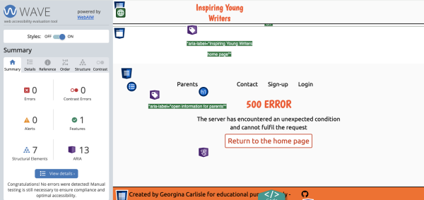

### Sign - up

Note: Four of the alerts are linked to longer alt text for the hero-images. Longer text was written purposefully in order to provide more detail for those unable to see the image. The fifth alert is being generated because the contact form can be accessed directly from a link within the form as well as from the main navigation. This extra link has been purposefully added in order to aid the user experience of the parent/guardian of a new user.

### Login

Note: The alerts are linked to longer alt text for the hero-images. Longer text was written purposefully in order to provide more detail for those unable to see the image.

### Forgotten Password

Password reset request:

Password reset email sent:

Password reset form:

Password reset success:

Note: There are four alerts given for all pages above that are linked to longer alt text for the hero-images. Longer text was written purposefully in order to provide more detail for those unable to see the image. There is also an additional alert given to the success message page. This fifth alert is being generated because the login page can be accessed directly from a link within the success message as well as from the main navigation. This extra link has been purposefully added in order to aid user experience.

### Account Home

Note: The alerts are linked to longer alt text for image. Longer text was written purposefully in order to provide more detail for those unable to see the image.

### Account contact

### My Work

### Create work

Note: Alert is linked to the back confirmation repeating the link to return to the my work page. This will be looked at in future iterations of the project.

### View work

### View feedback for my work

### Edit work

Note: Alert is linked to the back confirmation repeating the link to return to the my work page. This will be looked at in future iterations of the project.

### Library Of Inspiration

### Read work

### Read feedback

### Give feedback

### Edit feedback

[Return to contents list](#contents)

## Lighthouse

Chrome developer tools Lighthouse was used to test the performance, accessibility, best practices and SEO of all pages within the platform. The results are shown below:

### Landing Page

Results for desktop:

Results for mobile:

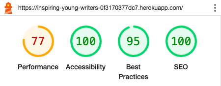

### Contact Us (New User Experience)

Results for desktop:

Results for mobile:

### Sign - up

Results for desktop:

Results for mobile:

### Login

Results for desktop:

Results for mobile:

### Forgotten Password

Password reset request:

Password reset email sent:

Password reset form:

Password reset success:

### Account Home

Results for desktop:

Results for mobile:

### Account contact

Results for desktop:

Results for mobile:

### My Work

Results for desktop:

Results for mobile:

### Create work

Results for desktop:

Results for mobile:

### View work

Results for desktop:

Results for mobile:

### View feedback for my work

### Edit work

Results for desktop:

Results for mobile:

### Library Of Inspiration

Results for desktop:

Results for mobile:

### Read work

Results for desktop:

Results for mobile:

### Read feedback

Results for desktop:

Results for mobile:

### Give feedback

Results for desktop:

Results for mobile:

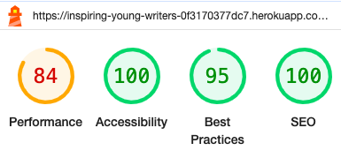

### Edit feedback

Results for desktop:

Results for mobile:

[Return to contents list](#contents)

## Responsive Testing

The platform has been fully tested across a range of screen sizes, from 350px upto 1920px. 

Tailwind's responsive design breakpoints were used alongside testing using chrome developer tools during development. The breakpoints used are as follows:
- Mobile first (< 640px )
- Small screens ( 640px - 768px )
- Medium screens ( 768px - 1024px )
- Large screens ( 1024px - 1280px )
- Extra large screens ( > 1280px)

Further testing was carried out on the final deployed site using:
- iphone12 mini
- MacbookAir 13inch
- Chrome Developer tools

Screenshots that show how the pages change across different screen sizes have been included below.

### Landing Page

#### Mobile first

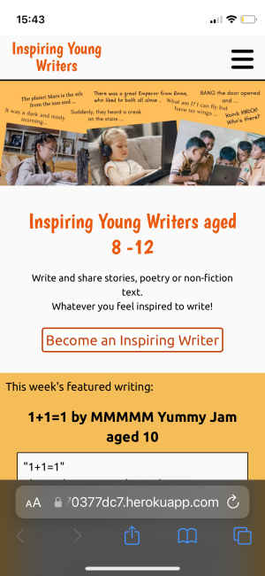

#### Small screens

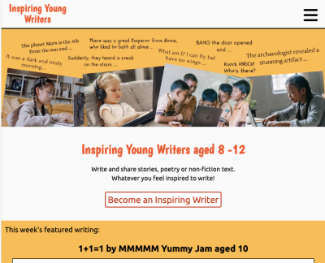

#### Medium screens

#### Large screens

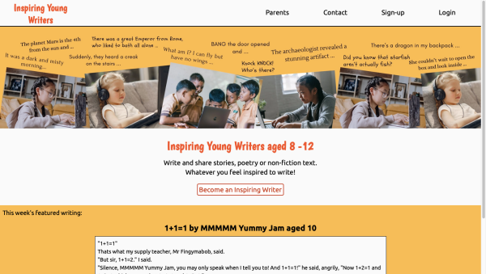

### Parent information

#### Mobile first

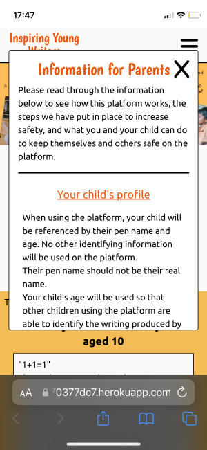

#### Medium screens

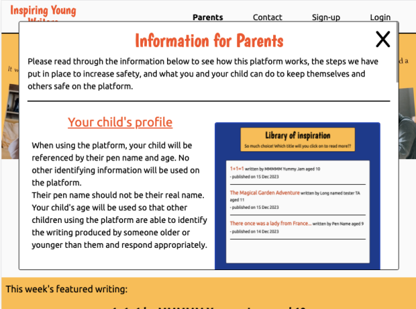

#### Large screens

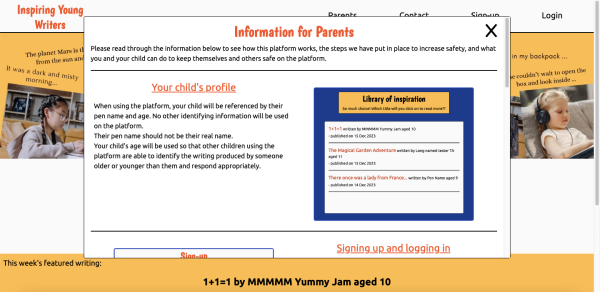

### Contact Us (New User Experience)

#### Mobile first

#### Medium screens

### Error Pages

#### Mobile first

#### Larger screens

### Sign-up Page

#### Mobile first

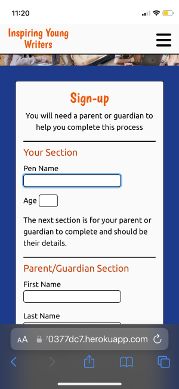

#### Medium and large screens

### Login Page

#### Mobile first

#### Medium and large screens

### Account home

#### Mobile first

#### Large screens

### Contact Us (Logged in user)

#### Mobile first

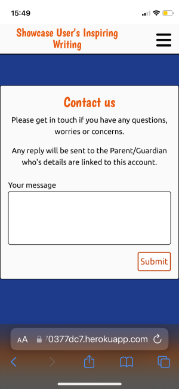

#### Large screens

### My work

#### Mobile first

#### Large screens

### Create Writing

#### Mobile first

#### Large screens

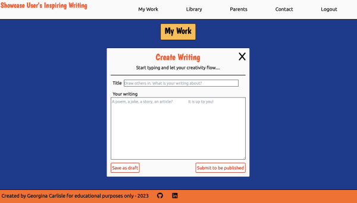

### View Writing

#### Mobile first

#### Larger screens

### Edit writing

#### Mobile first

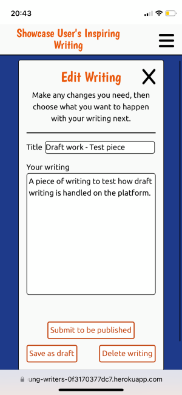

#### Larger screens

### Library

#### Mobile first

#### Larger screens

### Read

#### Mobile first

#### Larger screens

[Return to contents list](#contents)

### Give feedback

#### Mobile first

#### Small screens

#### Medium screens

#### Large screens

### Read feedback

#### Mobile first

#### Small screens

#### Medium screens

#### Large screens

### Edit feedback

#### Mobile first

#### Larger screens

## Compatibility Testing

The platform was built and test along the way predominantly in Chrome with some testing in Safari. Once the platform was completed and deployed testing was also carried out in the following browsers. All responded as expect with just some slight differences in the handing of email validation and blank input boxes (slightly different wording).

### Chrome

The platform has been fully tested in a chrome browser on both a MacBook Air and pc desktop.

### Safari

The platform has been fully tested in a Safari browser on both a MacBook Air and an iPhone 12 mini.

### Firefox

The platform has been fully tested in a firefox browser on a pc desktop.

### Edge

The platform has been fully tested in an edge browser on a pc desktop.

[Return to contents list](#contents)